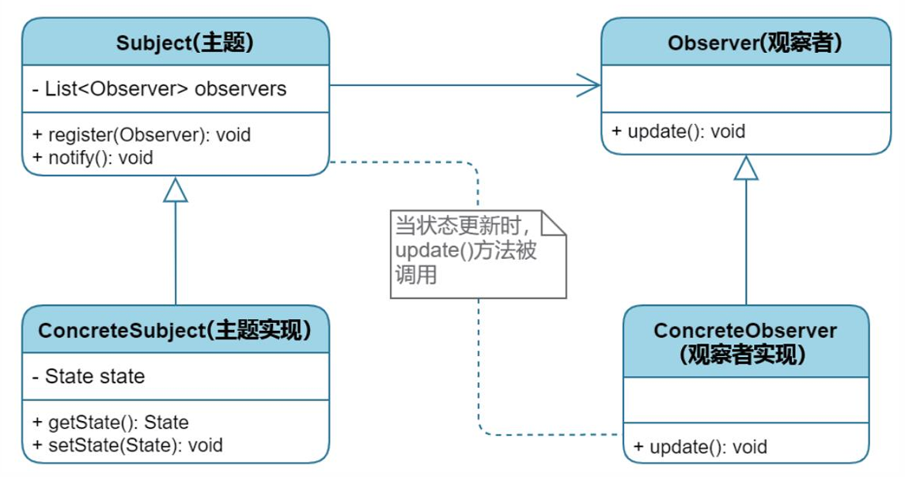
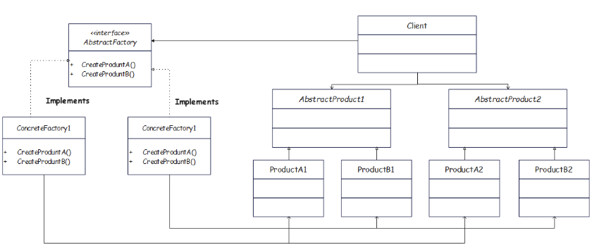
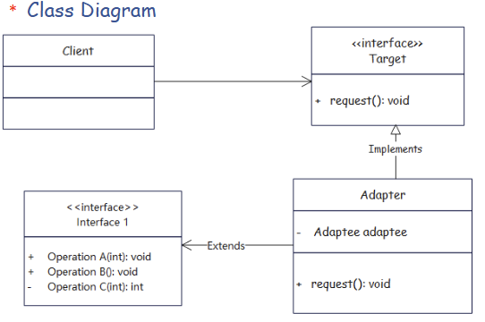
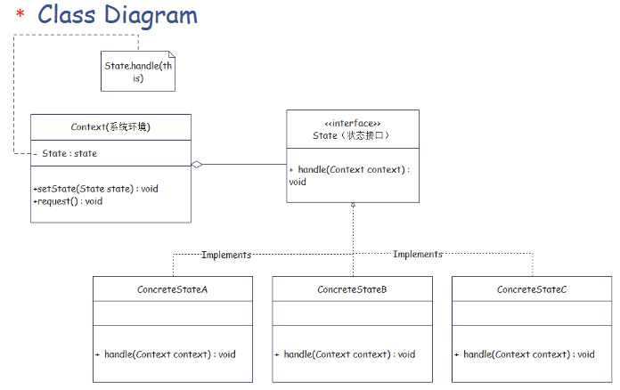

**1. 继承 / 泛化（Generalization）**

- **线的样子**  
  - **实线**  
  - 终点是一个**空心三角箭头**  
  - 箭头指向：**父类 / 更抽象的类**

- **含义**  
  - “A 是 B 的一种”（is-a）  
  - 子类继承父类，拥有父类的属性和方法，可以重写

- **代码对应**

  ```java
  class Sub extends Super { }
  ```
---

**2. 接口实现 / 实现关系（Realization）**

- **线的样子**
  - **虚线**  
  - 终点是**空心三角箭头**  
  - 箭头指向：**接口 / 抽象类型**

- **含义**
  - “A 实现了接口 B”
  - 类承诺提供接口定义的所有方法实现

- **代码对应**

  ```java
  class Addition implements Strategy { }
  ```


> 小结：  
> 实线 + 空心三角 = 继承（类 → 父类）  
> 虚线 + 空心三角 = 实现（类 → 接口）

---

**3. 关联（Association）**

- **线的样子**
  - **实线**  
  - 一般没有特殊箭头，或者在一端画一个**普通箭头**表示“可导航方向”
  - 线两端经常标注**多重性**：`1`、`0..1`、`*`、`1..*` 等

- **含义**
  - “A 中有 B 这个成员” 或 “A 知道 B”  
  - 这是最普通的“有关系”的线

- **代码对应**

  ```java
  class Computer {
      private USB usb; // Computer --- USB
  }
  ```

---

**4. 聚合（Aggregation，整体–部分，弱拥有）**

- **线的样子**
  - 在“整体”一端是个**空心菱形**  
  - 连接到“部分”是实线

- **含义**
  - “整体包含部分，但生命周期不强绑定”
  - 部分对象可以被多个整体共享，也可以脱离整体单独存在

- **代码感觉上类似**

  ```java
  class Team {
      private List<Player> players; // Team ◇── Player
  }
  ```

---

**5. 组合（Composition，整体–部分，强拥有）**

- **线的样子**
  - 在“整体”一端是**实心菱形**  
  - 连接到“部分”是实线

- **含义**
  - “整体由部分组成，生命周期绑定”
  - 整体销毁时，部分一定跟着销毁，部分通常不能被共享

- **代码感觉上类似**

  ```java
  class House {
      private Room room; // House ◆── Room
  }
  ```

- **在设计模式的例子里**
  - 组合更多出现在像组合模式（Composite Pattern）那类结构里，你现在看的策略/工厂里一般不会画成组合。

---

**6. 依赖（Dependency）**

- **线的样子**
  - **虚线**  
  - 终点是**空心箭头**（不是三角形）  
  - 箭头指向被依赖的类

- **含义**
  - “A 用到了 B，但不是长期持有成员”
  - 表现在：方法参数、局部变量、方法内部临时调用等


# I. Singleton

**Singleton**是一种常用的软件设计模式，它确保一个类只有一个实例，并提供一个全局访问点来获取这个实例。单例模式通常用于管理共享资源，如配置文件、线程池、缓存等。

## 类图

以下是Singleton模式的类图表示：

```
+--------------------------+
|    Singleton             |
+--------------------------+
| +instance: Singleton     |
+--------------------------+
| +getInstance(): Singleton|
| -Singleton(): void       |
+--------------------------+
```

- **instance**：静态私有成员变量，用于存储唯一的实例。
- **getInstance()**：静态公有方法，用于获取唯一的实例。
- **Singleton()**：私有构造函数，防止外部通过`new`关键字创建实例。

## 示例代码

以下是用Java实现的Singleton模式代码：

```java
public class Singleton {
    // 静态私有成员变量，存储唯一的实例
    private static Singleton instance;

    // 私有构造函数，防止外部通过new关键字创建实例
    private Singleton() {
    }

    // 静态公有方法，用于获取唯一的实例
    public static Singleton getInstance() {
        if (instance == null) { // 检查实例是否已经创建
            instance = new Singleton(); // 如果未创建，则创建一个新实例
        }
        return instance; // 返回唯一的实例
    }
}
```

## 使用示例

```java
public class Main {
    public static void main(String[] args) {
        // 获取Singleton实例
        Singleton singleton1 = Singleton.getInstance();
        singleton1.showMessage(); // 输出：Hello from Singleton!

        // 再次获取Singleton实例
        Singleton singleton2 = Singleton.getInstance();
        singleton2.showMessage(); // 输出：Hello from Singleton!

        // 检查两个实例是否相同
        System.out.println(singleton1 == singleton2); // 输出：true
    }
}
```

## 说明

1. **线程安全问题**：
   - 上述代码在多线程环境下可能会出现问题，因为`getInstance()`方法在检查`instance`是否为`null`时可能会被多个线程同时访问。
   - 为了解决线程安全问题，可以使用同步机制（如`synchronized`关键字）或使用双重检查锁定（Double-Checked Locking）模式。

2. **懒汉式与饿汉式**：
   - 上述实现是懒汉式（Lazy Initialization），即在第一次调用`getInstance()`时才创建实例。
   - 饿汉式（Eager Initialization）是另一种实现方式，实例在类加载时就创建，代码如下：

```java
public class Singleton {
    // 静态私有成员变量，实例在类加载时创建
    private static Singleton instance = new Singleton();

    // 私有构造函数
    private Singleton() {
    }

    // 静态公有方法，返回唯一的实例
    public static Singleton getInstance() {
        return instance;
    }
}
```

饿汉式实现简单且线程安全，但实例在类加载时就被创建，可能会浪费资源。

# II. Observer
观察者模式是一种行为设计模式，它定义了对象之间的一对多依赖关系，当一个对象（主题）的状态发生改变时，所有依赖它的对象（观察者）都会自动收到通知并更新。这种模式常用于实现事件处理系统。
## 核心角色

- Subject（主题）：维护一个观察者列表，提供添加、删除和通知观察者的方法。
- Observer（观察者）：定义一个更新接口，用于接收主题的通知。
- ConcreteSubject（具体主题）：实现主题接口，存储具体状态，并在状态改变时通知观察者。
- ConcreteObserver（具体观察者）：实现观察者接口，定义具体的更新逻辑。


## 代码示例（Java 实现）

按照你给的截图，我把这组代码整理成标准 Java 源码（缩进、命名、结构都更清晰），你可以直接复制到 IDE 里使用。

```java
import java.util.ArrayList;
import java.util.List;

// 主题：商店
public class SmartShop {
    private String product;
    private List<Buyer> buyers;

    public SmartShop() {
        this.product = "無商品";
        this.buyers = new ArrayList<>();
    }

    public void register(Buyer buyer) {
        this.buyers.add(buyer);
    }

    public String getProduct() {
        return product;
    }

    public void setProduct(String product) {
        this.product = product;
        notifyBuyers();
    }

    public void notifyBuyers() {
        buyers.stream().forEach(b -> b.inform(this.getProduct()));
    }
}

// 抽象观察者：买家
public abstract class Buyer {
    protected String name;

    public Buyer(String name) {
        this.name = name;
    }

    public abstract void inform(String product);
}

// 具体观察者：手机粉
public class PhoneFans extends Buyer {

    public PhoneFans(String name) {
        super(name);
    }

    @Override
    public void inform(String product) {
        if (product.contains("手機")) {
            System.out.print(name);
            System.out.println(" 購買： " + product);
        }
    }
}

// 具体观察者：剁手族
public class HandChopper extends Buyer {

    public HandChopper(String name) {
        super(name);
    }

    @Override
    public void inform(String product) {
        System.out.print(name);
        System.out.println(" 購買： " + product);
    }
}

// 客户端测试
public class Client {
    public static void main(String[] args) {
        Buyer tangSir = new PhoneFans("手機粉");
        Buyer barJee = new HandChopper("剁手族");

        SmartShop shop = new SmartShop();
        shop.register(tangSir);
        shop.register(barJee);

        shop.setProduct("豬肉脯餅乾");
        shop.setProduct("香蕉手機");
    }
}
```
### UML 

```text
+--------------------------------------------+
|        Buyer                               |<<abstract>>
+--------------------------------------------+
| - name: String                             |
+--------------------------------------------+
| + Buyer(name: String)                      |
| + inform(product: String): void (abstract) |
+--------------------------------------------+
             ^
             |
   +----------------------+        +------------------------+
   |      PhoneFans       |        |     HandChopper        |
   +----------------------+        +------------------------+
   |                      |        |                        |
   +----------------------+        +------------------------+
   | + PhoneFans(name)    |        | + HandChopper(name)    |
   | + inform(product)    |        | + inform(product)      |
   +----------------------+        +------------------------+


+-------------------------------------+
|         SmartShop                   |
+-------------------------------------+
| - product: String                   |
| - buyers: List<Buyer>               |
+-------------------------------------+
| + SmartShop()                       |
| + register(buyer: Buyer): void      |
| + getProduct(): String              |
| + setProduct(product: String): void |
| + notifyBuyers(): void              |
+-------------------------------------+
             ^
             |  registers / notifies
             |  (1..* association)
             |
           Buyer


+-----------------------------+
|          Client             |
+-----------------------------+
|                             |
+-----------------------------+
| + main(args: String[]):void |
+-----------------------------  
         |
         | uses
         v
   SmartShop, PhoneFans, HandChopper
```

**关系说明：**

- **Buyer 为抽象类**  
  - 属性：`name`  
  - 抽象方法：`inform(String product)`  
- **PhoneFans、HandChopper** 继承 `Buyer`  
  - 都实现 `inform(String product)`，只是具体逻辑不同。
- **SmartShop**  
  - 维护一个 `List<Buyer>`，表示“多个买家观察店铺”  
  - `register` 用来添加观察者  
  - `setProduct` 修改 `product` 后调用 `notifyBuyers()`  
  - `notifyBuyers` 遍历列表，调用每个买家的 `inform`
- **Client**  
  - 在 `main` 中创建 `PhoneFans`、`HandChopper` 和 `SmartShop`  
  - 调用 `shop.register(...)` 建立“主题–观察者”关系  
  - 通过 `shop.setProduct(...)` 触发通知

**结构对应关系：**

- `SmartShop` = Subject（主题），持有 `List<Buyer>`，负责 `register` 和 `notifyBuyers`
- `Buyer` = 抽象观察者
- `PhoneFans`、`HandChopper` = 具体观察者，根据 `product` 决定如何响应
- `Client` 创建主题和观察者，注册后，通过 `setProduct` 触发通知

# III. Strategy

**策略模式（Strategy Pattern）**是一种行为型设计模式，用来在**运行时**在多种“算法/策略”之间自由切换，而不用在代码里写一大堆 `if-else` 或 `switch`。

**一句话概括：**  
把一组“可以互相替换的算法”封装成独立的策略类，通过“组合而不是继承”的方式，让使用者在运行时选择、切换具体算法。

---

**核心角色**

- **Strategy（策略接口）**  
  定义一组可互换算法的统一接口，例如 `calculatePrice()`, `sort()`, `pay()` 等。
- **ConcreteStrategy（具体策略）**  
  实现不同的算法，比如“打 9 折”“满 100 减 20”“信用卡支付”“微信支付”等。
- **Context（上下文）**  
  持有一个 `Strategy` 引用，对外提供统一的功能入口；内部把工作委托给当前策略。

---
下面把你给的策略模式代码整理成「示例代码1」，然后给出对应的类图。

**示例代码1：策略模式——加减计算器**

```java
// 策略接口
public interface Strategy {
    int calculate(int a, int b);
}

// 具体策略：加法
public class Addition implements Strategy {
    @Override
    public int calculate(int a, int b) {
        return a + b;
    }
}

// 具体策略：减法
public class Subtraction implements Strategy {
    @Override
    public int calculate(int a, int b) {
        return a - b;
    }
}

// 上下文：使用策略的计算器
public class Calculator {
    private Strategy strategy;

    public void setStrategy(Strategy strategy) {
        this.strategy = strategy;
    }

    public int getResult(int a, int b) {
        return this.strategy.calculate(a, b);
    }
}

// 客户端测试
public class Client {
    public static void main(String[] args) {
        Calculator calculator = new Calculator();

        calculator.setStrategy(new Addition());
        System.out.println(calculator.getResult(561654, 1552));

        calculator.setStrategy(new Subtraction());
        System.out.println(calculator.getResult(1234, 233));
    }
}
```

---

**类图**

```text
             +--------------------------------+
             |        Strategy                |<<interface>>
             +--------------------------------+
             | + calculate(a:int, b:int): int |
             +--------------------------------+
                ^                  ^
                |                  |
+-------------------------+   +--------------------------+
|        Addition         |   |       Subtraction        |
+-------------------------+   +--------------------------+
|                         |   |                          |
+-------------------------+   +--------------------------+
| + calculate(a,b): int   |   | + calculate(a,b): int    |
+-------------------------+   +--------------------------+


+--------------------------------+
|        Calculator              |
+--------------------------------+
| - strategy: Strategy           |
+--------------------------------+
| + setStrategy(Strategy)        |
| + getResult(a:int, b:int): int |
+--------------------------------+
             ^
             | uses
             |
         Strategy


+----------------------------+
|          Client            |
+----------------------------+
|                            |
+----------------------------+
| + main(args:String[]):void |
+----------------------------+
        |
        | uses
        v
   Calculator, Addition, Subtraction
```
**示例代码2：USB 设备“策略”切换**

```java
// 策略接口：USB 设备
public interface USB {
    void read();
}

// 具体策略：鼠标
public class Mouse implements USB {
    @Override
    public void read() {
        System.out.println("鼠标指令数据……");
    }
}

// 具体策略：键盘
public class KeyBoard implements USB {
    @Override
    public void read() {
        System.out.println("键盘指令数据……");
    }
}

// 具体策略：摄像头
public class Camera implements USB {
    @Override
    public void read() {
        System.out.println("视频流数据……");
    }
}

// 上下文：电脑
public class Computer {
    private USB usb;

    public void setUSB(USB usb) {
        this.usb = usb;
    }

    public void compute() {
        usb.read();
    }
}

// 客户端测试
public class Client {
    public static void main(String[] args) {
        Computer com = new Computer();

        com.setUSB(new KeyBoard());
        com.compute();

        com.setUSB(new Mouse());
        com.compute();

        com.setUSB(new Camera());
        com.compute();
    }
}
```
**类图**

```text
                +----------------------+
                |        USB           | <<interface>>
                +----------------------+
                | + read(): void       |
                +----------------------+
                  ^         ^         ^
                  |         |         |
     +----------------+  +----------------+  +----------------+
     |     Mouse      |  |    KeyBoard    |  |    Camera      |
     +----------------+  +----------------+  +----------------+
     |                |  |                |  |                |
     +----------------+  +----------------+  +----------------+
     | + read(): void |  | + read(): void |  | + read(): void |
     +----------------+  +----------------+  +----------------+


+--------------------------+
|        Computer          |
+--------------------------+
| - usb: USB               |
+--------------------------+
| + setUSB(usb: USB): void |
| + compute(): void        |
+--------------------------+
             ^
             | uses / has-a
             |
            USB


+-----------------------------+
|          Client             |
+-----------------------------+
|                             |
+-----------------------------+
| + main(args: String[]):void |
+-----------------------------+
          |
          | uses
          v
      Computer, USB 实现类
```

**关系说明：**

- `USB` 是接口（策略接口），定义 `read()` 方法。
- `Mouse`、`KeyBoard`、`Camera` 都 `implements USB`，是不同的“具体策略”。
- `Computer` 持有一个 `USB usb` 成员，通过 `setUSB` 注入不同的 USB 设备，在 `compute()` 中调用 `usb.read()`。
- `Client` 在 `main` 中创建 `Computer`，依次给它插入 `KeyBoard`、`Mouse`、`Camera`，从而在运行时切换“策略”。

---

# IV Factory Method

**概念**

Factory Method（工厂方法模式）是一种**创建型设计模式**：

> 定义一个用于创建对象的接口，让子类决定实例化哪一个具体类。  
> 使一个类的实例化延迟到其子类。

通俗一点：  
不在代码里直接 `new 具体类()`，而是**把“怎么 new”这个逻辑放进工厂方法里**，然后通过不同的工厂子类来创建不同产品。

---

**核心角色**

- **Product（产品抽象）**  
  要被创建的对象的抽象接口/抽象类。
- **ConcreteProduct（具体产品）**  
  实际被创建的具体类，实现 Product。
- **Creator（工厂抽象）**  
  声明工厂方法 `createProduct()`，返回一个 `Product`。里面可以有一些依赖产品的业务逻辑。
- **ConcreteCreator（具体工厂）**  
  实现工厂方法，决定实例化哪一个 `ConcreteProduct`。

---

# V Abstract Factory

**Abstract Factory（抽象工厂模式）**

**一句话：**  
在**不指定具体类**的前提下，提供一个创建“**一族相关产品**”的接口。  
如果工厂方法是“造一种产品”，抽象工厂就是“造一整套产品族”。

---

**核心动机**

- 你需要创建的是**一组相互搭配使用的对象**，比如：
  - 不同操作系统的一套 UI：Button、TextField、Checkbox…
  - 不同品牌的一套产品：小米手机 + 小米平板 + 小米手环；苹果手机 + iPad + Apple Watch…
- 客户端只想说：“给我一套苹果产品 / 一套小米产品”，而不想写一堆 `new IPhone()`、`new IPad()`、`new MacBook()`。

---

**核心角色**

- **AbstractProductX（抽象产品）**
  - 每一类产品一个抽象接口，例如：`Button`、`TextField`。
- **ConcreteProductX（具体产品）**
  - 抽象产品的不同实现，例如：`WinButton`、`MacButton`。
- **AbstractFactory（抽象工厂）**
  - 声明一组“创建不同抽象产品”的方法：
    - `createButton()`
    - `createTextField()`
- **ConcreteFactory（具体工厂）**
  - 实现这组创建方法，**保证一套产品是同一个“家族/风格”**：
    - `WinFactory` 创建 `WinButton` + `WinTextField`
    - `MacFactory` 创建 `MacButton` + `MacTextField`

---

**简单 Java 示例：不同操作系统的 UI 组件**

```java
// 抽象产品：按钮
interface Button {
    void click();
}

// 抽象产品：文本框
interface TextField {
    void input(String text);
}

// 具体产品：Windows 风格
class WinButton implements Button {
    @Override
    public void click() {
        System.out.println("Windows 按钮被点击");
    }
}

class WinTextField implements TextField {
    @Override
    public void input(String text) {
        System.out.println("Windows 文本框输入: " + text);
    }
}

// 具体产品：Mac 风格
class MacButton implements Button {
    @Override
    public void click() {
        System.out.println("Mac 按钮被点击");
    }
}

class MacTextField implements TextField {
    @Override
    public void input(String text) {
        System.out.println("Mac 文本框输入: " + text);
    }
}

// 抽象工厂：一族 UI 组件
interface UIFactory {
    Button createButton();
    TextField createTextField();
}

// 具体工厂：Windows 工厂
class WinFactory implements UIFactory {
    @Override
    public Button createButton() {
        return new WinButton();
    }

    @Override
    public TextField createTextField() {
        return new WinTextField();
    }
}

// 具体工厂：Mac 工厂
class MacFactory implements UIFactory {
    @Override
    public Button createButton() {
        return new MacButton();
    }

    @Override
    public TextField createTextField() {
        return new MacTextField();
    }
}

// 客户端
public class Client {
    public static void main(String[] args) {
        UIFactory factory;

        // 选择一个“产品族”
        factory = new WinFactory();
        Button btn1 = factory.createButton();
        TextField tf1 = factory.createTextField();
        btn1.click();
        tf1.input("Hello Windows");

        factory = new MacFactory();
        Button btn2 = factory.createButton();
        TextField tf2 = factory.createTextField();
        btn2.click();
        tf2.input("Hello Mac");
    }
}
```

下面是刚才 **Abstract Factory（UIFactory）示例代码** 对应的类图，用文本 UML 画出来，方便你理解结构和关系。

---

**类图**

```text
                 +----------------------+
                 |       Button         | <<interface>>
                 +----------------------+
                 | + click(): void      |
                 +----------------------+
                     ^              ^
                     |              |
        +------------------+   +------------------+
        |    WinButton     |   |    MacButton     |
        +------------------+   +------------------+
        |                  |   |                  |
        +------------------+   +------------------+
        | + click(): void  |   | + click(): void  |
        +------------------+   +------------------+


                 +------------------------+
                 |       TextField        | <<interface>>
                 +------------------------+
                 | + input(text:String):void |
                 +------------------------+
                     ^                   ^
                     |                   |
        +-----------------------+   +-----------------------+
        |     WinTextField      |   |     MacTextField      |
        +-----------------------+   +-----------------------+
        |                       |   |                       |
        +-----------------------+   +-----------------------+
        | + input(text): void   |   | + input(text): void   |
        +-----------------------+   +-----------------------+


               +------------------------------+
               |          UIFactory           | <<interface>>
               +------------------------------+
               | + createButton(): Button     |
               | + createTextField():TextField|
               +------------------------------+
                     ^                    ^
                     |                    |
        +-------------------------+   +-------------------------+
        |        WinFactory       |   |       MacFactory        |
        +-------------------------+   +-------------------------+
        |                         |   |                         |
        +-------------------------+   +-------------------------+
        | + createButton()        |   | + createButton()        |
        | + createTextField()     |   | + createTextField()     |
        +-------------------------+   +-------------------------+


 +---------------------------+
 |          Client           |
 +---------------------------+
 | + main(args:String[]):void|
 +---------------------------+
             |
             | uses
             v
        UIFactory, Button, TextField
```

---

**关系对应说明**

- `Button`、`TextField`、`UIFactory`  
  - 都是**接口**，在类图中用 `<<interface>>` 标注。
- `WinButton` / `MacButton` **实现** `Button`  
  - UML 中是**虚线 + 空心三角箭头**指向 `Button`。
- `WinTextField` / `MacTextField` **实现** `TextField`。
- `WinFactory` / `MacFactory` **实现** `UIFactory`  
  - 负责创建对应“产品族”的 `Button` 和 `TextField`。
- `Client`  
  - 依赖 `UIFactory`、`Button`、`TextField` 抽象，通过选择不同的具体工厂，在运行时得到不同风格的一整套组件。

你可以把这段文本类图直接当成 README 里“抽象工厂示例”的类图说明，或者之后用 PlantUML 之类工具再画成图片。
客户端只依赖 `UIFactory`、`Button`、`TextField` 这些抽象，**切换一行工厂创建代码，就能换整套 UI**。

---

**和 Factory Method 的区别（你已经学过）**

- **Factory Method**：一个工厂方法负责创建**一种产品**  
  - 例：`LoggerFactory.createLogger()` → 返回一个 `Logger`
- **Abstract Factory**：一个工厂接口里有**多个工厂方法**，一起创建**一整族产品**  
  - 例：`UIFactory.createButton()` + `createTextField()` + … → 同一风格的一套组件

可以记成：

> Factory Method：一个“工厂方法”解决“单一产品”的创建。  
> Abstract Factory：一组“工厂方法”解决“多种相关产品”的成套创建。


# VI  Adapter
**Adapter（适配器模式）**

**一句话：**  
当“现有类的接口”跟“客户端期望的接口”不同时，用一个适配器在中间转换，让原来的类可以在不修改代码的情况下被复用。

---

**核心角色**

- **Target（目标接口）**  
  客户端**期望**使用的接口形式。
- **Adaptee（被适配者）**  
  已经存在的类，功能有了，但接口“不对口”。
- **Adapter（适配器）**  
  同时依赖 Target 和 Adaptee：  
  对外实现 Target，对内转调 Adaptee，把调用“翻译”过去。
- **Client（客户端）**  
  只面向 Target 编程，通过 Adapter 间接使用 Adaptee。

---

**简单 Java 示例**

场景：客户端希望调用 `play(String fileName)` 播放 MP3，但现有库里只有一个 `AdvancedPlayer`，方法是 `playMp4`、`playAvi` 等。

```java
// 目标接口：客户端希望看到的统一接口
interface MediaPlayer {
    void play(String fileName);
}

// 已有类：接口不兼容
class AdvancedPlayer {
    void playMp4(String fileName) {
        System.out.println("播放 MP4: " + fileName);
    }

    void playAvi(String fileName) {
        System.out.println("播放 AVI: " + fileName);
    }
}

// 适配器：把 MediaPlayer 接口适配到 AdvancedPlayer
class MediaAdapter implements MediaPlayer {
    private AdvancedPlayer advancedPlayer = new AdvancedPlayer();

    @Override
    public void play(String fileName) {
        if (fileName.endsWith(".mp4")) {
            advancedPlayer.playMp4(fileName);
        } else if (fileName.endsWith(".avi")) {
            advancedPlayer.playAvi(fileName);
        } else {
            System.out.println("不支持的格式: " + fileName);
        }
    }
}

// 客户端
public class Client {
    public static void main(String[] args) {
        MediaPlayer player = new MediaAdapter();
        player.play("movie.mp4");
        player.play("demo.avi");
    }
}
```

这里：

- `MediaPlayer` 是 **Target**
- `AdvancedPlayer` 是 **Adaptee**
- `MediaAdapter` 是 **Adapter**
- `Client` 只认 `MediaPlayer`，不直接接触 `AdvancedPlayer`

---

**类图（对象适配器）**

```text
          +------------------------+
          |      MediaPlayer      | <<Target>>
          +------------------------+
          | + play(file:String)   |
          +------------------------+
                    ^
                    |
          +------------------------+
          |     MediaAdapter       | <<Adapter>>
          +------------------------+
          | - advancedPlayer:AdvancedPlayer |
          +------------------------+
          | + play(file:String)   |
          +------------------------+
                    |
          uses      |
                    v
          +------------------------+
          |    AdvancedPlayer      | <<Adaptee>>
          +------------------------+
          | + playMp4(file)       |
          | + playAvi(file)       |
          +------------------------+


          +------------------------+
          |        Client          |
          +------------------------+
          | + main(...)           |
          +------------------------+
                    |
                    | uses
                    v
               MediaPlayer
```

---

**两种常见形式**

- **对象适配器**（上面的例子）：Adapter 内部**组合**一个 Adaptee 对象（常用、灵活）。
- **类适配器**：Adapter 通过 `extends Adaptee` + `implements Target` 的方式适配（需要多重继承支持，Java 里不太常用）。

下面把你给的插头适配例子整理成“**适配器模式 示例2**”，然后画出类图。

---

**示例代码2：三孔插座适配两孔插头**

```java
public interface TriplePin {
    void electrify(int l, int n, int e);
}

public interface DualPin {
    void electrify(int l, int n);
}

public class TV implements DualPin {
    @Override
    public void electrify(int l, int n) {
        System.out.println("火线通电: " + l + "，零线通电: " + n);
        System.out.println("电视开始工作");
    }
}

public class Adapter implements TriplePin {
    private DualPin dualPinDevice;

    public Adapter(DualPin dualPinDevice) {
        this.dualPinDevice = dualPinDevice;
    }

    @Override
    public void electrify(int l, int n, int e) {
        System.out.println("使用适配器，忽略地线参数: " + e);
        dualPinDevice.electrify(l, n);
    }
}

public class AdapterClient {
    public static void main(String[] args) {
        DualPin tvDualPinDevice = new TV();
        TriplePin triplePinDevice = new Adapter(tvDualPinDevice);
        triplePinDevice.electrify(1, 0, -1);
    }
}
```

这段代码体现的是**对象适配器**：`Adapter` 组合了一个 `DualPin` 设备，把 `TriplePin` 调用转换成 `DualPin` 调用。

---

**类图（UML 文本表示）**

```text
             +-------------------------+
             |       TriplePin         | <<interface>>
             +-------------------------+
             | + electrify(l:int,      |
             |              n:int,     |
             |              e:int):void|
             +-------------------------+

             +-------------------------+
             |        DualPin          | <<interface>>
             +-------------------------+
             | + electrify(l:int,      |
             |              n:int):void|
             +-------------------------+

                              +-------------------------+
                              |          TV            |
                              +-------------------------+
                              |                         |
                              +-------------------------+
                              | + electrify(l,n): void  |
                              +-------------------------+
                                      ^
                                      |
                         implements   |
                         (realization)|
                    DualPin ─ ─ ─ ─ ──┘


                    +-------------------------------+
                    |           Adapter             |
                    +-------------------------------+
                    | - dualPinDevice: DualPin      |
                    +-------------------------------+
                    | + Adapter(dual:DualPin)       |
                    | + electrify(l,n,e): void      |
                    +-------------------------------+
                           ^                 |
                           | implements      | uses / has-a
                           | (realization)   v
                  TriplePin ─ ─ ─ ─ ─ ─ ─> DualPin


                    +-------------------------------+
                    |        AdapterClient          |
                    +-------------------------------+
                    | + main(args:String[]): void   |
                    +-------------------------------+
                               |
                               | uses
                               v
                         TriplePin, DualPin, TV, Adapter
```

**关系对应：**

- `TriplePin`、`DualPin`：目标接口 / 被适配接口
- `TV implements DualPin`：电视是两孔设备
- `Adapter implements TriplePin`，内部组合 `DualPin`：适配器把三孔接口“翻译”为两孔接口
- `AdapterClient`：
  - 面向 `TriplePin` 编程
  - 通过 `new Adapter(new TV())` 在三孔环境里复用两孔电视设备

# VII Decorator

**Decorator（装饰器模式）**

**一句话：**  
在不修改原有类、不改变对象类型的前提下，**在运行时“套一层一层壳”给对象动态增加功能**。

---

**核心思想**

- 原始对象实现某个接口（或抽象类），叫 **Component**。
- 装饰器也实现同一个接口，内部**组合一个 Component 对象**。
- 对外看起来还是这个接口类型，但行为在“转调用前后”被增强了。
- 可以多层嵌套：`new LoggingDecorator(new CompressionDecorator(new FileOutputStream(...)))`。

---

**角色**

- **Component（抽象组件）**  
  定义统一接口，比如 `operation()`、`read()`、`send()`。
- **ConcreteComponent（具体组件）**  
  原始对象，提供基础功能。
- **Decorator（抽象装饰器，可选）**  
  实现 Component，并持有一个 Component 引用，作为装饰器父类。
- **ConcreteDecorator（具体装饰器）**  
  在调用被包装对象前后增加新行为。

---

**简单 Java 示例：对“发送消息”进行装饰**

```java
interface Message {
    String getContent();
}

class SimpleMessage implements Message {
    private String content;

    public SimpleMessage(String content) {
        this.content = content;
    }

    @Override
    public String getContent() {
        return content;
    }
}

abstract class MessageDecorator implements Message {
    protected Message message;

    public MessageDecorator(Message message) {
        this.message = message;
    }
}

class HtmlMessageDecorator extends MessageDecorator {
    public HtmlMessageDecorator(Message message) {
        super(message);
    }

    @Override
    public String getContent() {
        return "<html>" + message.getContent() + "</html>";
    }
}

class EncryptionMessageDecorator extends MessageDecorator {
    public EncryptionMessageDecorator(Message message) {
        super(message);
    }

    @Override
    public String getContent() {
        String original = message.getContent();
        return new StringBuilder(original).reverse().toString();
    }
}

public class Client {
    public static void main(String[] args) {
        Message msg = new SimpleMessage("hello");
        msg = new HtmlMessageDecorator(msg);
        msg = new EncryptionMessageDecorator(msg);
        System.out.println(msg.getContent());
    }
}
```

调用顺序：

1. `SimpleMessage` 返回 `"hello"`。
2. `HtmlMessageDecorator` 把它包装成 `"<html>hello</html>"`。
3. `EncryptionMessageDecorator` 再把字符串“加密”（这里用反转代替），得到 `">lmth/<olleh>lmth<"`。

对象类型始终是 `Message`，但行为被一层层增强，这就是 Decorator。

---

**和继承的区别**

- 继承：在类定义阶段扩展行为，类一旦写死就很难组合变化。
- 装饰器：在对象使用阶段组合、叠加各种功能，灵活搭配。
- 当“可能的功能组合很多”时，用 Decorator 比“为每种组合写一个子类”要干净得多。

Please use the decoration mode to complete the ice cream order system, which
needs to include adding chocolate, adding jam, adding MM beans, and adding fruit
pieces. Vanilla base, coffee base, matcha base. (It is not necessary to write the
specific execution code, but the structure and client program need to be written).
---

**1. Component interface**

```java
// Component
public interface IceCream {
    String getDescription();
    double getCost();
}
```

---

**2. Concrete Components: base flavors**

```java
// ConcreteComponent: Vanilla base
public class VanillaBase implements IceCream {
    @Override
    public String getDescription() {
        return "Vanilla base";
    }

    @Override
    public double getCost() {
        return 10.0; // arbitrary base price
    }
}

// ConcreteComponent: Coffee base
public class CoffeeBase implements IceCream {
    @Override
    public String getDescription() {
        return "Coffee base";
    }

    @Override
    public double getCost() {
        return 11.0;
    }
}

// ConcreteComponent: Matcha base
public class MatchaBase implements IceCream {
    @Override
    public String getDescription() {
        return "Matcha base";
    }

    @Override
    public double getCost() {
        return 12.0;
    }
}
```

---

**3. Abstract Decorator**

```java
// Decorator
public abstract class IceCreamDecorator implements IceCream {
    protected IceCream inner;

    public IceCreamDecorator(IceCream inner) {
        this.inner = inner;
    }

    @Override
    public String getDescription() {
        return inner.getDescription();
    }

    @Override
    public double getCost() {
        return inner.getCost();
    }
}
```

---

**4. Concrete Decorators: toppings**

```java
// ConcreteDecorator: add chocolate
public class ChocolateDecorator extends IceCreamDecorator {
    public ChocolateDecorator(IceCream inner) {
        super(inner);
    }

    @Override
    public String getDescription() {
        return inner.getDescription() + " + chocolate";
    }

    @Override
    public double getCost() {
        return inner.getCost() + 2.0;
    }
}

// ConcreteDecorator: add jam
public class JamDecorator extends IceCreamDecorator {
    public JamDecorator(IceCream inner) {
        super(inner);
    }

    @Override
    public String getDescription() {
        return inner.getDescription() + " + jam";
    }

    @Override
    public double getCost() {
        return inner.getCost() + 1.5;
    }
}

// ConcreteDecorator: add M&M beans
public class MmBeansDecorator extends IceCreamDecorator {
    public MmBeansDecorator(IceCream inner) {
        super(inner);
    }

    @Override
    public String getDescription() {
        return inner.getDescription() + " + M&M beans";
    }

    @Override
    public double getCost() {
        return inner.getCost() + 2.5;
    }
}

// ConcreteDecorator: add fruit pieces
public class FruitDecorator extends IceCreamDecorator {
    public FruitDecorator(IceCream inner) {
        super(inner);
    }

    @Override
    public String getDescription() {
        return inner.getDescription() + " + fruit pieces";
    }

    @Override
    public double getCost() {
        return inner.getCost() + 3.0;
    }
}
```

---

**5. Client program (order examples)**

```java
public class IceCreamClient {
    public static void main(String[] args) {
        // Example 1: vanilla base + chocolate + jam
        IceCream order1 = new VanillaBase();
        order1 = new ChocolateDecorator(order1);
        order1 = new JamDecorator(order1);

        System.out.println(order1.getDescription());
        System.out.println("Total cost: " + order1.getCost());

        // Example 2: coffee base + M&M beans
        IceCream order2 = new CoffeeBase();
        order2 = new MmBeansDecorator(order2);

        System.out.println(order2.getDescription());
        System.out.println("Total cost: " + order2.getCost());

        // Example 3: matcha base + fruit pieces + chocolate + M&M beans
        IceCream order3 = new MatchaBase();
        order3 = new FruitDecorator(order3);
        order3 = new ChocolateDecorator(order3);
        order3 = new MmBeansDecorator(order3);

        System.out.println(order3.getDescription());
        System.out.println("Total cost: " + order3.getCost());
    }
}
```

---

**结构对应关系**

- `IceCream`：Component 接口
- `VanillaBase / CoffeeBase / MatchaBase`：ConcreteComponent，代表不同冰淇淋“基底”
- `IceCreamDecorator`：抽象 Decorator，统一持有一个 `IceCream` 引用
- `ChocolateDecorator / JamDecorator / MmBeansDecorator / FruitDecorator`：ConcreteDecorator，添加配料
- `IceCreamClient`：客户端，通过不断用装饰器“包裹”基底对象来组成订单

# VIII Command

**Command Pattern（命令模式）**

**一句话：**  
把“要做的事情”封装成一个对象（Command），让**请求的发出者**和**执行者**解耦，并且可以对这些“命令对象”排队、记录、撤销、重做等。

---

**1. 核心动机**

通常我们会这样写代码：

```java
button.onClick(() -> light.turnOn());
```

按钮直接调用电灯的方法，**按钮知道电灯是谁，也知道要调哪个方法**，耦合很紧。如果想：

- 一个按钮有时开灯、有时开门、有时播放音乐；
- 支持“撤销上一次操作”；
- 把操作记录成日志以后重放；

直接写 if-else 会越来越乱。  
命令模式的想法是：**把“开灯”这种请求包装成一个对象**，Button 只负责“触发命令”，不再关心命令具体干了什么。

---

**2. 角色**

- **Command（命令接口）**  
  抽象出统一的 `execute()` 方法，有时还会有 `undo()`。
- **ConcreteCommand（具体命令）**  
  内部持有一个“接收者”（Receiver），在 `execute` 里调用接收者的具体操作。
- **Receiver（接收者）**  
  真正干活的对象，比如 Light、TV、FileSystem。
- **Invoker（调用者）**  
  触发命令的地方，比如 Button、MenuItem、遥控器。
- **Client（客户端）**  
  负责装配：创建接收者、命令对象，并把命令塞给调用者。


---

**3. 简单 Java 示例：遥控器开灯 / 关灯**

```java
// 命令接口
interface Command {
    void execute();
}

// 接收者：电灯
class Light {
    public void turnOn() {
        System.out.println("Light ON");
    }

    public void turnOff() {
        System.out.println("Light OFF");
    }
}

// 具体命令：开灯
class LightOnCommand implements Command {
    private Light light;

    public LightOnCommand(Light light) {
        this.light = light;
    }

    @Override
    public void execute() {
        light.turnOn();
    }
}

// 具体命令：关灯
class LightOffCommand implements Command {
    private Light light;

    public LightOffCommand(Light light) {
        this.light = light;
    }

    @Override
    public void execute() {
        light.turnOff();
    }
}

// 调用者：遥控器按钮
class RemoteButton {
    private Command command;

    public RemoteButton(Command command) {
        this.command = command;
    }

    public void press() {
        command.execute();
    }
}

// 客户端：装配命令
public class Client {
    public static void main(String[] args) {
        Light light = new Light();

        Command onCommand = new LightOnCommand(light);
        Command offCommand = new LightOffCommand(light);

        RemoteButton onButton = new RemoteButton(onCommand);
        RemoteButton offButton = new RemoteButton(offCommand);

        onButton.press();   // Light ON
        offButton.press();  // Light OFF
    }
}
```

**关键点：**

- `RemoteButton` 只持有 `Command` 接口，不需要知道“灯”是谁。
- `LightOnCommand` / `LightOffCommand` 各自知道怎么操作 `Light`。
- 想把按钮改成“关灯”→只需要给按钮换一个命令对象。

---

**4. 类图关系（文字版）**

```text
           +-------------------+
           |     Command       | <<interface>>
           +-------------------+
           | + execute():void  |
           +-------------------+
                 ^        ^
                 |        |
   +----------------+  +------------------+
   | LightOnCommand |  | LightOffCommand  |
   +----------------+  +------------------+
   | - light:Light  |  | - light:Light    |
   +----------------+  +------------------+
   | + execute()    |  | + execute()      |
   +----------------+  +------------------+
             |               |
             | uses          | uses
             v               v
          +----------------------+
          |        Light         |
          +----------------------+
          | + turnOn()           |
          | + turnOff()          |
          +----------------------+


          +----------------------+
          |     RemoteButton     | <<Invoker>>
          +----------------------+
          | - command:Command    |
          +----------------------+
          | + press():void       |
          +----------------------+
                    ^
                    | uses
                    |
                 Command
```

---

**5. 命令模式适合用在**

- GUI 中：按钮、菜单项、快捷键绑定各种命令；
- 事务 / 操作日志：记录操作，支持撤销、重做；
- 任务队列：把要执行的操作封装成命令对象，投到队列里再慢慢执行；
- 宏命令：把多个命令组合成一个“批处理命令”。

# IX State
**State Pattern（状态模式）**

**一句话：**  
当一个对象在不同状态下要表现出**完全不同的行为**时，把这些“状态下的行为”封装成独立的状态类，让对象在内部切换“当前状态”，而不是在一个大 `if-else` / `switch` 里到处判断状态。

---

**1. 核心思想**

没有状态模式时，你可能这样写：

```java
class Context {
    private int state; // 0: Ready, 1: Running, 2: Paused ...

    public void handle() {
        if (state == 0) {
            // Ready 的行为
        } else if (state == 1) {
            // Running 的行为
        } else if (state == 2) {
            // Paused 的行为
        }
    }
}
```

- 状态越多，`if-else` 越长；
- 每加一个状态，都要改这个类的很多地方；
- 和 **Strategy** 不同的是：状态之间通常会**相互切换**（比如从 Ready → Running → Paused → Running → Stopped）。

状态模式把“每种状态下的行为”拆成类：

- `State` 接口：定义环境在某个状态下会对请求做什么；
- 每个状态类负责：**在当前状态下怎么处理请求 + 什么时候切换到下一个状态**。

---

**2. 角色**

- **State（状态接口）**  
  定义在不同状态下要响应的操作，比如 `handle()`、`play()`、`stop()` 等。
- **ConcreteState（具体状态类）**  
  实现状态接口，封装该状态下的具体行为，并在合适时机切换 `Context` 的当前状态。
- **Context（环境 / 上下文）**  
  持有一个 `State` 引用，所有对外行为都委托给当前 `state` 对象；  
  提供方法给状态类用来“切换状态”：`setState(...)`。

---

**3. 简单 Java 示例：电梯状态**

电梯有几种状态：停止（Stopped）、运行（Running）、故障（Broken），按下按钮时行为不同。

```java
// 状态接口
interface ElevatorState {
    void pressButton(Elevator context);
}

// 环境类
class Elevator {
    private ElevatorState state;

    public Elevator(ElevatorState initState) {
        this.state = initState;
    }

    public void setState(ElevatorState state) {
        this.state = state;
    }

    public void pressButton() {
        state.pressButton(this);
    }
}

// 具体状态：停止
class StoppedState implements ElevatorState {
    @Override
    public void pressButton(Elevator context) {
        System.out.println("电梯启动，开始运行");
        context.setState(new RunningState());
    }
}

// 具体状态：运行中
class RunningState implements ElevatorState {
    @Override
    public void pressButton(Elevator context) {
        System.out.println("电梯正在运行，忽略按钮");
        // 也可以在某些条件下切到其他状态
    }
}

// 具体状态：故障
class BrokenState implements ElevatorState {
    @Override
    public void pressButton(Elevator context) {
        System.out.println("电梯故障，无法响应");
    }
}

// 客户端
public class Client {
    public static void main(String[] args) {
        Elevator elevator = new Elevator(new StoppedState());

        elevator.pressButton(); // 启动 → RunningState
        elevator.pressButton(); // 运行中，忽略
        
        elevator.setState(new BrokenState());
        elevator.pressButton(); // 故障，无法响应
    }
}
```

**要点：**

- `Elevator` 不再用 `if (state == ...)` 决定行为；
- 每个状态类负责“本状态下该怎么干 + 要不要切换状态”；
- 想增加新状态时，只需加一个新的 `ConcreteState`，并在别的状态里决定是否切换过去。

---

**4. 和 Strategy / State 的区别（容易混）**

- **Strategy（策略模式）**  
  - 通常由客户端主动选择使用哪种算法/策略；
  - 策略之间一般**不会自己切换**。
- **State（状态模式）**  
  - 通常由对象内部根据业务流程**自动切换状态**；
  - 每个状态知道“下一步可能转到哪里”。

一句对比：  
> Strategy：同一事，不同做法，**外部选策略**。  
> State：同一对象，随状态变，**内部切状态**。

Here is a **cleaned State-pattern version** of your traffic‑light example, plus the **class diagram**.

---

**1. 整理后的代码结构**

```java
// State interface
public interface State {
    void switchToGreen(TrafficLight trafficLight);
    void switchToYellow(TrafficLight trafficLight);
    void switchToRed(TrafficLight trafficLight);
}

// Concrete state: Red
public class Red implements State {

    @Override
    public void switchToGreen(TrafficLight trafficLight) {
        System.out.println("ERROR!!! 红灯不能直接切换为绿灯。");
    }

    @Override
    public void switchToYellow(TrafficLight trafficLight) {
        trafficLight.setState(new Yellow());
        System.out.println("OK... 红灯结束，黄灯准备 5 秒。");
    }

    @Override
    public void switchToRed(TrafficLight trafficLight) {
        System.out.println("ERROR!!! 已经是红灯，无需再次切换。");
    }
}

// Concrete state: Green
public class Green implements State {

    @Override
    public void switchToGreen(TrafficLight trafficLight) {
        System.out.println("ERROR!!! 已经是绿灯，无需再次切换。");
    }

    @Override
    public void switchToYellow(TrafficLight trafficLight) {
        trafficLight.setState(new Yellow());
        System.out.println("OK... 绿灯结束，黄灯亮起 5 秒。");
    }

    @Override
    public void switchToRed(TrafficLight trafficLight) {
        System.out.println("ERROR!!! 绿灯不能直接切换为红灯。");
    }
}

// Concrete state: Yellow
public class Yellow implements State {

    @Override
    public void switchToGreen(TrafficLight trafficLight) {
        trafficLight.setState(new Green());
        System.out.println("OK... 黄灯结束，切换为绿灯。");
    }

    @Override
    public void switchToYellow(TrafficLight trafficLight) {
        System.out.println("ERROR!!! 已经是黄灯，无需再次切换。");
    }

    @Override
    public void switchToRed(TrafficLight trafficLight) {
        trafficLight.setState(new Red());
        System.out.println("OK... 黄灯结束，切换为红灯。");
    }
}

// Context
public class TrafficLight {
    private State state = new Red();  // 初始状态：红灯

    public void setState(State state) {
        this.state = state;
    }

    public void switchToGreen() {
        state.switchToGreen(this);
    }

    public void switchToYellow() {
        state.switchToYellow(this);
    }

    public void switchToRed() {
        state.switchToRed(this);
    }
}

// Client
public class TrafficLightClient {
    public static void main(String[] args) {
        TrafficLight trafficLight = new TrafficLight();

        trafficLight.switchToYellow(); // 红 -> 黄
        trafficLight.switchToGreen();  // 黄 -> 绿
        trafficLight.switchToYellow(); // 绿 -> 黄
        trafficLight.switchToRed();    // 黄 -> 红
        trafficLight.switchToGreen();  // 红 -> 绿（错误示例）
    }
}
```

关键点：

- **状态判断全部放到状态类里**（Red/Green/Yellow），`TrafficLight` 不写 if/else。
- 状态切换通过 `trafficLight.setState(new Xxx())` 完成。
- `TrafficLight` 对外只提供 `switchToGreen/Yellow/Red()`，具体行为由当前 `state` 决定。

---


---

**1. 先看接口：所有状态都必须实现的操作**

```java
public interface State {
    void switchToGreen(TrafficLight trafficLight);
    void switchToYellow(TrafficLight trafficLight);
    void switchToRed(TrafficLight trafficLight);
}
```

含义：

- 这是“**状态接口**”，描述在某种状态下，**如果有人要求切成绿/黄/红灯，该怎么处理**。
- 每个具体状态类（Red、Green、Yellow）都要实现这 3 个方法。
- 每个方法都接收 `TrafficLight trafficLight`，是为了：
  - 在内部可以调用 `trafficLight.setState(...)` 来**修改交通灯当前状态**。

---

**2. 具体状态：Red / Green / Yellow**

以 `Red` 为例：

```java
public class Red implements State {

    @Override
    public void switchToGreen(TrafficLight trafficLight) {
        System.out.println("ERROR!!! 红灯不能直接切换为绿灯。");
    }

    @Override
    public void switchToYellow(TrafficLight trafficLight) {
        trafficLight.setState(new Yellow());
        System.out.println("OK... 红灯结束，黄灯准备 5 秒。");
    }

    @Override
    public void switchToRed(TrafficLight trafficLight) {
        System.out.println("ERROR!!! 已经是红灯，无需再次切换。");
    }
}
```

- 当前是**红灯状态**时：
  - 调 `switchToGreen`：打印错误提示，不允许红→绿。
  - 调 `switchToYellow`：允许红→黄：
    - `trafficLight.setState(new Yellow());` 把上下文状态切成 `Yellow`；
    - 打印“红灯结束，黄灯准备……”
  - 调 `switchToRed`：已经是红灯，再切红灯是无效操作，打印错误。

`Green` 和 `Yellow` 类同理，只是规则不同：

- `Green`：
  - 不能直接绿→红；
  - 可以绿→黄（`setState(new Yellow())`），表示绿灯结束，黄灯缓冲。
- `Yellow`：
  - 可以黄→绿，也可以黄→红（根据你设计的流程）；
  - 已经是黄灯就不能再切黄。

**关键点：**  
每个状态类“知道自己在当前状态下，哪些切换是允许的，哪些是错误的，并负责在允许时修改 TrafficLight 的状态”。

---

**3. 环境类 TrafficLight：持有当前状态**

```java
public class TrafficLight {
    private State state = new Red();  // 初始状态：红灯

    public void setState(State state) {
        this.state = state;
    }

    public void switchToGreen() {
        state.switchToGreen(this);
    }

    public void switchToYellow() {
        state.switchToYellow(this);
    }

    public void switchToRed() {
        state.switchToRed(this);
    }
}
```

作用：

- `TrafficLight` 是**上下文(Context)**，代表一个现实中的红绿灯。
- 内部有一个 `State state` 字段：
  - 一开始设为 `new Red()`，表示刚创建时是红灯。
- 对外暴露三个方法：
  - `switchToGreen()` / `switchToYellow()` / `switchToRed()`
- 但它自己**不做任何逻辑判断**，只把请求转发给当前状态对象：
  - `state.switchToGreen(this);`  
  - 参数 `this` 传进去，让状态有机会调用 `setState` 修改当前状态。

**这就是状态模式最关键的一点：**

> TrafficLight 不用 `if (state == RED)` 之类的判断，  
> 把“在当前状态下要做什么”完全交给 `state` 对象。

---

**4. 客户端：模拟状态切换过程**

```java
public class TrafficLightClient {
    public static void main(String[] args) {
        TrafficLight trafficLight = new TrafficLight();

        trafficLight.switchToYellow(); // 红 -> 黄
        trafficLight.switchToGreen();  // 黄 -> 绿
        trafficLight.switchToYellow(); // 绿 -> 黄
        trafficLight.switchToRed();    // 黄 -> 红
        trafficLight.switchToGreen();  // 红 -> 绿（这里会报 ERROR）
    }
}
```

执行流程大概是：

1. 创建 `TrafficLight`，内部 `state = new Red()`。
2. `trafficLight.switchToYellow();`
   - 当前 `state` 是 `Red` → 调 `Red.switchToYellow(this)`：
     - 允许：`setState(new Yellow())`，并打印“红灯结束，黄灯准备 5 秒。”
3. `trafficLight.switchToGreen();`
   - 当前 `state` 已是 `Yellow` → 调 `Yellow.switchToGreen(this)`：
     - 允许：`setState(new Green())`，打印“黄灯结束，切换为绿灯。”
4. 接下来依次类似，最终再 `switchToGreen()` 时：
   - 如果当前是 `Red`，调用 `Red.switchToGreen(this)`，会输出“ERROR!!! 红灯不能直接切换为绿灯。”

---

**5. 总结一下这个例子体现的 State 模式**

- **State 接口**：定义红灯、绿灯、黄灯“在自己状态下”如何响应“切换请求”。
- **Red/Green/Yellow**：  
  - 决定当前状态允许什么、不允许什么；  
  - 在适当时机调用 `trafficLight.setState(...)` 切换到下一个状态。
- **TrafficLight（Context）**：只持有当前 `State`，对外提供统一的切换方法，不写 if-else。
- **Client**：只是按业务顺序调用 `switchToXXX`，不关心内部状态逻辑。


**2. 类图（文本 UML）**

```text
                 +------------------------+
                 |         State          | <<interface>>
                 +------------------------+
                 | + switchToGreen(tl)    |
                 | + switchToYellow(tl)   |
                 | + switchToRed(tl)      |
                 +------------------------+
                    ^          ^          ^
                    |          |          |
          +---------------+  +---------------+  +---------------+
          |      Red      |  |     Green     |  |    Yellow     |
          +---------------+  +---------------+  +---------------+
          |               |  |               |  |               |
          +---------------+  +---------------+  +---------------+
          | + switchTo... |  | + switchTo... |  | + switchTo... |
          +---------------+  +---------------+  +---------------+
                    \           |           /
                     \          |          /
                      \         |         /
                       \        |        /
                        v       v       v

                 +----------------------------+
                 |       TrafficLight         |  <<Context>>
                 +----------------------------+
                 | - state: State             |
                 +----------------------------+
                 | + setState(State)          |
                 | + switchToGreen()          |
                 | + switchToYellow()         |
                 | + switchToRed()            |
                 +----------------------------+


                 +----------------------------+
                 |    TrafficLightClient      | <<Client>>
                 +----------------------------+
                 | + main(args:String[]):void |
                 +----------------------------+
                             |
                             | uses
                             v
                       TrafficLight
```

- `State` 是状态接口；
- `Red`、`Green`、`Yellow` 实现 `State`，封装每种灯光状态下的行为和状态切换；
- `TrafficLight` 持有当前 `State`，对外暴露切换方法；
- `TrafficLightClient` 只是按顺序调用这些方法来模拟状态变化。
