# 目录

- [0 类图关系](#-0-类图关系)
- [I. Singleton](#i-singleton)
- [II. Observer](#ii-observer)
- [III. Strategy](#iii-strategy)
- [IV Factory Method](#iv-factory-method)
- [V Abstract Factory](#v-abstract-factory)
- [VI Adapter](#vi--adapter)
- [VII Decorator](#vii-decorator)
- [VIII Command](#viii-command)
- [IX State](#ix-state)
- [X Template Method](#x-template-method)
- [XI Builder](#xi-builder)
- [XII Prototype](#xii-prototype)
- [XIII Proxy](#xiii-proxy)
- [XIV Chain of Responsibility](#xiv-chain-of-responsibility)
- [XV Mediator](#xv-mediator)
- [XVI Memento](#xvi-memento)
- [XVII Iterator](#xvii-iterator)
- [XVIII Flyweight](#xviii-flyweight)
- [Six Principles of Software Design](#six-principles-of-software-design)
---

# 0 类图关系

**1. 继承 / 泛化（Generalization）**

- **线的样子**  
  - **实线**  
  - 终点是一个**空心三角箭头**  
  - 箭头指向：**父类 / 更抽象的类**

- **含义**  
  - “A 是 B 的一种”（is-a）  
  - 子类继承父类，拥有父类的属性和方法，可以重写

- **代码对应**

  ```java
  class Sub extends Super { }
  ```
---

**2. 接口实现 / 实现关系（Realization）**

- **线的样子**
  - **虚线**  
  - 终点是**空心三角箭头**  
  - 箭头指向：**接口 / 抽象类型**

- **含义**
  - “A 实现了接口 B”
  - 类承诺提供接口定义的所有方法实现

- **代码对应**

  ```java
  class Addition implements Strategy { }
  ```


> 小结：  
> 实线 + 空心三角 = 继承（类 → 父类）  
> 虚线 + 空心三角 = 实现（类 → 接口）

---

**3. 关联（Association）**

- **线的样子**
  - **实线**  
  - 一般没有特殊箭头，或者在一端画一个**普通箭头**表示“可导航方向”
  - 线两端经常标注**多重性**：`1`、`0..1`、`*`、`1..*` 等

- **含义**
  - “A 中有 B 这个成员” 或 “A 知道 B”  
  - 这是最普通的“有关系”的线

- **代码对应**

  ```java
  class Computer {
      private USB usb; // Computer --- USB
  }
  ```

---

**4. 聚合（Aggregation，整体–部分，弱拥有）**

- **线的样子**
  - 在“整体”一端是个**空心菱形**  
  - 连接到“部分”是实线

- **含义**
  - “整体包含部分，但生命周期不强绑定”
  - 部分对象可以被多个整体共享，也可以脱离整体单独存在

- **代码感觉上类似**

  ```java
  class Team {
      private List<Player> players; // Team ◇── Player
  }
  ```

---

**5. 组合（Composition，整体–部分，强拥有）**

- **线的样子**
  - 在“整体”一端是**实心菱形**  
  - 连接到“部分”是实线

- **含义**
  - “整体由部分组成，生命周期绑定”
  - 整体销毁时，部分一定跟着销毁，部分通常不能被共享

- **代码感觉上类似**

  ```java
  class House {
      private Room room; // House ◆── Room
  }
  ```

- **在设计模式的例子里**
  - 组合更多出现在像组合模式（Composite Pattern）那类结构里，你现在看的策略/工厂里一般不会画成组合。

---

**6. 依赖（Dependency）**

- **线的样子**
  - **虚线**  
  - 终点是**空心箭头**（不是三角形）  
  - 箭头指向被依赖的类

- **含义**
  - “A 用到了 B，但不是长期持有成员”
  - 表现在：方法参数、局部变量、方法内部临时调用等


# I. Singleton

**Singleton**是一种常用的软件设计模式，它确保一个类只有一个实例，并提供一个全局访问点来获取这个实例。单例模式通常用于管理共享资源，如配置文件、线程池、缓存等。

## 类图

以下是Singleton模式的类图表示：

```
+--------------------------+
|    Singleton             |
+--------------------------+
| +instance: Singleton     |
+--------------------------+
| +getInstance(): Singleton|
| -Singleton(): void       |
+--------------------------+
```

- **instance**：静态私有成员变量，用于存储唯一的实例。
- **getInstance()**：静态公有方法，用于获取唯一的实例。
- **Singleton()**：私有构造函数，防止外部通过`new`关键字创建实例。

## 示例代码

以下是用Java实现的Singleton模式代码：

```java
public class Singleton {
    // 静态私有成员变量，存储唯一的实例
    private static Singleton instance;

    // 私有构造函数，防止外部通过new关键字创建实例
    private Singleton() {
    }

    // 静态公有方法，用于获取唯一的实例
    public static Singleton getInstance() {
        if (instance == null) { // 检查实例是否已经创建
            instance = new Singleton(); // 如果未创建，则创建一个新实例
        }
        return instance; // 返回唯一的实例
    }
}
```

## 使用示例

```java
public class Main {
    public static void main(String[] args) {
        // 获取Singleton实例
        Singleton singleton1 = Singleton.getInstance();
        singleton1.showMessage(); // 输出：Hello from Singleton!

        // 再次获取Singleton实例
        Singleton singleton2 = Singleton.getInstance();
        singleton2.showMessage(); // 输出：Hello from Singleton!

        // 检查两个实例是否相同
        System.out.println(singleton1 == singleton2); // 输出：true
    }
}
```

## 说明

1. **线程安全问题**：
   - 上述代码在多线程环境下可能会出现问题，因为`getInstance()`方法在检查`instance`是否为`null`时可能会被多个线程同时访问。
   - 为了解决线程安全问题，可以使用同步机制（如`synchronized`关键字）或使用双重检查锁定（Double-Checked Locking）模式。

2. **懒汉式与饿汉式**：
   - 上述实现是懒汉式（Lazy Initialization），即在第一次调用`getInstance()`时才创建实例。
   - 饿汉式（Eager Initialization）是另一种实现方式，实例在类加载时就创建，代码如下：

```java
public class Singleton {
    // 静态私有成员变量，实例在类加载时创建
    private static Singleton instance = new Singleton();

    // 私有构造函数
    private Singleton() {
    }

    // 静态公有方法，返回唯一的实例
    public static Singleton getInstance() {
        return instance;
    }
}
```

饿汉式实现简单且线程安全，但实例在类加载时就被创建，可能会浪费资源。

# II. Observer
观察者模式是一种行为设计模式，它定义了对象之间的一对多依赖关系，当一个对象（主题）的状态发生改变时，所有依赖它的对象（观察者）都会自动收到通知并更新。这种模式常用于实现事件处理系统。
## 核心角色

- Subject（主题）：维护一个观察者列表，提供添加、删除和通知观察者的方法。
- Observer（观察者）：定义一个更新接口，用于接收主题的通知。
- ConcreteSubject（具体主题）：实现主题接口，存储具体状态，并在状态改变时通知观察者。
- ConcreteObserver（具体观察者）：实现观察者接口，定义具体的更新逻辑。


## 代码示例（Java 实现）

按照你给的截图，我把这组代码整理成标准 Java 源码（缩进、命名、结构都更清晰），你可以直接复制到 IDE 里使用。

```java
import java.util.ArrayList;
import java.util.List;

// 主题：商店
public class SmartShop {
    private String product;
    private List<Buyer> buyers;

    public SmartShop() {
        this.product = "無商品";
        this.buyers = new ArrayList<>();
    }

    public void register(Buyer buyer) {
        this.buyers.add(buyer);
    }

    public String getProduct() {
        return product;
    }

    public void setProduct(String product) {
        this.product = product;
        notifyBuyers();
    }

    public void notifyBuyers() {
        buyers.stream().forEach(b -> b.inform(this.getProduct()));
    }
}

// 抽象观察者：买家
public abstract class Buyer {
    protected String name;

    public Buyer(String name) {
        this.name = name;
    }

    public abstract void inform(String product);
}

// 具体观察者：手机粉
public class PhoneFans extends Buyer {

    public PhoneFans(String name) {
        super(name);
    }

    @Override
    public void inform(String product) {
        if (product.contains("手機")) {
            System.out.print(name);
            System.out.println(" 購買： " + product);
        }
    }
}

// 具体观察者：剁手族
public class HandChopper extends Buyer {

    public HandChopper(String name) {
        super(name);
    }

    @Override
    public void inform(String product) {
        System.out.print(name);
        System.out.println(" 購買： " + product);
    }
}

// 客户端测试
public class Client {
    public static void main(String[] args) {
        Buyer tangSir = new PhoneFans("手機粉");
        Buyer barJee = new HandChopper("剁手族");

        SmartShop shop = new SmartShop();
        shop.register(tangSir);
        shop.register(barJee);

        shop.setProduct("豬肉脯餅乾");
        shop.setProduct("香蕉手機");
    }
}
```
### UML 

```text
+--------------------------------------------+
|        Buyer                               |<<abstract>>
+--------------------------------------------+
| - name: String                             |
+--------------------------------------------+
| + Buyer(name: String)                      |
| + inform(product: String): void (abstract) |
+--------------------------------------------+
             ^
             |
   +----------------------+        +------------------------+
   |      PhoneFans       |        |     HandChopper        |
   +----------------------+        +------------------------+
   |                      |        |                        |
   +----------------------+        +------------------------+
   | + PhoneFans(name)    |        | + HandChopper(name)    |
   | + inform(product)    |        | + inform(product)      |
   +----------------------+        +------------------------+


+-------------------------------------+
|         SmartShop                   |
+-------------------------------------+
| - product: String                   |
| - buyers: List<Buyer>               |
+-------------------------------------+
| + SmartShop()                       |
| + register(buyer: Buyer): void      |
| + getProduct(): String              |
| + setProduct(product: String): void |
| + notifyBuyers(): void              |
+-------------------------------------+
             ^
             |  registers / notifies
             |  (1..* association)
             |
           Buyer


+-----------------------------+
|          Client             |
+-----------------------------+
|                             |
+-----------------------------+
| + main(args: String[]):void |
+-----------------------------  
         |
         | uses
         v
   SmartShop, PhoneFans, HandChopper
```

**关系说明：**

- **Buyer 为抽象类**  
  - 属性：`name`  
  - 抽象方法：`inform(String product)`  
- **PhoneFans、HandChopper** 继承 `Buyer`  
  - 都实现 `inform(String product)`，只是具体逻辑不同。
- **SmartShop**  
  - 维护一个 `List<Buyer>`，表示“多个买家观察店铺”  
  - `register` 用来添加观察者  
  - `setProduct` 修改 `product` 后调用 `notifyBuyers()`  
  - `notifyBuyers` 遍历列表，调用每个买家的 `inform`
- **Client**  
  - 在 `main` 中创建 `PhoneFans`、`HandChopper` 和 `SmartShop`  
  - 调用 `shop.register(...)` 建立“主题–观察者”关系  
  - 通过 `shop.setProduct(...)` 触发通知

**结构对应关系：**

- `SmartShop` = Subject（主题），持有 `List<Buyer>`，负责 `register` 和 `notifyBuyers`
- `Buyer` = 抽象观察者
- `PhoneFans`、`HandChopper` = 具体观察者，根据 `product` 决定如何响应
- `Client` 创建主题和观察者，注册后，通过 `setProduct` 触发通知

# III. Strategy

**策略模式（Strategy Pattern）**是一种行为型设计模式，用来在**运行时**在多种“算法/策略”之间自由切换，而不用在代码里写一大堆 `if-else` 或 `switch`。

**一句话概括：**  
把一组“可以互相替换的算法”封装成独立的策略类，通过“组合而不是继承”的方式，让使用者在运行时选择、切换具体算法。

---

**核心角色**

- **Strategy（策略接口）**  
  定义一组可互换算法的统一接口，例如 `calculatePrice()`, `sort()`, `pay()` 等。
- **ConcreteStrategy（具体策略）**  
  实现不同的算法，比如“打 9 折”“满 100 减 20”“信用卡支付”“微信支付”等。
- **Context（上下文）**  
  持有一个 `Strategy` 引用，对外提供统一的功能入口；内部把工作委托给当前策略。
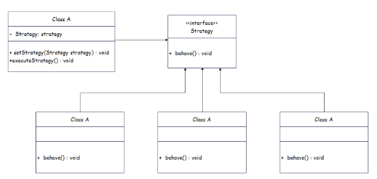
---
下面把你给的策略模式代码整理成「示例代码1」，然后给出对应的类图。

**示例代码1：策略模式——加减计算器**

```java
// 策略接口
public interface Strategy {
    int calculate(int a, int b);
}

// 具体策略：加法
public class Addition implements Strategy {
    @Override
    public int calculate(int a, int b) {
        return a + b;
    }
}

// 具体策略：减法
public class Subtraction implements Strategy {
    @Override
    public int calculate(int a, int b) {
        return a - b;
    }
}

// 上下文：使用策略的计算器
public class Calculator {
    private Strategy strategy;

    public void setStrategy(Strategy strategy) {
        this.strategy = strategy;
    }

    public int getResult(int a, int b) {
        return this.strategy.calculate(a, b);
    }
}

// 客户端测试
public class Client {
    public static void main(String[] args) {
        Calculator calculator = new Calculator();

        calculator.setStrategy(new Addition());
        System.out.println(calculator.getResult(561654, 1552));

        calculator.setStrategy(new Subtraction());
        System.out.println(calculator.getResult(1234, 233));
    }
}
```

---

**类图**

```text
             +--------------------------------+
             |        Strategy                |<<interface>>
             +--------------------------------+
             | + calculate(a:int, b:int): int |
             +--------------------------------+
                ^                  ^
                |                  |
+-------------------------+   +--------------------------+
|        Addition         |   |       Subtraction        |
+-------------------------+   +--------------------------+
|                         |   |                          |
+-------------------------+   +--------------------------+
| + calculate(a,b): int   |   | + calculate(a,b): int    |
+-------------------------+   +--------------------------+


+--------------------------------+
|        Calculator              |
+--------------------------------+
| - strategy: Strategy           |
+--------------------------------+
| + setStrategy(Strategy)        |
| + getResult(a:int, b:int): int |
+--------------------------------+
             ^
             | uses
             |
         Strategy


+----------------------------+
|          Client            |
+----------------------------+
|                            |
+----------------------------+
| + main(args:String[]):void |
+----------------------------+
        |
        | uses
        v
   Calculator, Addition, Subtraction
```
**示例代码2：USB 设备“策略”切换**

```java
// 策略接口：USB 设备
public interface USB {
    void read();
}

// 具体策略：鼠标
public class Mouse implements USB {
    @Override
    public void read() {
        System.out.println("鼠标指令数据……");
    }
}

// 具体策略：键盘
public class KeyBoard implements USB {
    @Override
    public void read() {
        System.out.println("键盘指令数据……");
    }
}

// 具体策略：摄像头
public class Camera implements USB {
    @Override
    public void read() {
        System.out.println("视频流数据……");
    }
}

// 上下文：电脑
public class Computer {
    private USB usb;

    public void setUSB(USB usb) {
        this.usb = usb;
    }

    public void compute() {
        usb.read();
    }
}

// 客户端测试
public class Client {
    public static void main(String[] args) {
        Computer com = new Computer();

        com.setUSB(new KeyBoard());
        com.compute();

        com.setUSB(new Mouse());
        com.compute();

        com.setUSB(new Camera());
        com.compute();
    }
}
```
**类图**

```text
                +----------------------+
                |        USB           | <<interface>>
                +----------------------+
                | + read(): void       |
                +----------------------+
                  ^         ^         ^
                  |         |         |
     +----------------+  +----------------+  +----------------+
     |     Mouse      |  |    KeyBoard    |  |    Camera      |
     +----------------+  +----------------+  +----------------+
     |                |  |                |  |                |
     +----------------+  +----------------+  +----------------+
     | + read(): void |  | + read(): void |  | + read(): void |
     +----------------+  +----------------+  +----------------+


+--------------------------+
|        Computer          |
+--------------------------+
| - usb: USB               |
+--------------------------+
| + setUSB(usb: USB): void |
| + compute(): void        |
+--------------------------+
             ^
             | uses / has-a
             |
            USB


+-----------------------------+
|          Client             |
+-----------------------------+
|                             |
+-----------------------------+
| + main(args: String[]):void |
+-----------------------------+
          |
          | uses
          v
      Computer, USB 实现类
```

**关系说明：**

- `USB` 是接口（策略接口），定义 `read()` 方法。
- `Mouse`、`KeyBoard`、`Camera` 都 `implements USB`，是不同的“具体策略”。
- `Computer` 持有一个 `USB usb` 成员，通过 `setUSB` 注入不同的 USB 设备，在 `compute()` 中调用 `usb.read()`。
- `Client` 在 `main` 中创建 `Computer`，依次给它插入 `KeyBoard`、`Mouse`、`Camera`，从而在运行时切换“策略”。

---

# IV Factory Method

**概念**

Factory Method（工厂方法模式）是一种**创建型设计模式**：

> 定义一个用于创建对象的接口，让子类决定实例化哪一个具体类。  
> 使一个类的实例化延迟到其子类。

通俗一点：  
不在代码里直接 `new 具体类()`，而是**把“怎么 new”这个逻辑放进工厂方法里**，然后通过不同的工厂子类来创建不同产品。

---

**核心角色**

- **Product（产品抽象）**  
  要被创建的对象的抽象接口/抽象类。
- **ConcreteProduct（具体产品）**  
  实际被创建的具体类，实现 Product。
- **Creator（工厂抽象）**  
  声明工厂方法 `createProduct()`，返回一个 `Product`。里面可以有一些依赖产品的业务逻辑。
- **ConcreteCreator（具体工厂）**  
  实现工厂方法，决定实例化哪一个 `ConcreteProduct`。
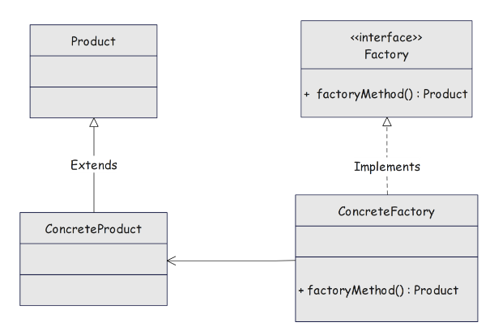
---

# V Abstract Factory

**Abstract Factory（抽象工厂模式）**

**一句话：**  
在**不指定具体类**的前提下，提供一个创建“**一族相关产品**”的接口。  
如果工厂方法是“造一种产品”，抽象工厂就是“造一整套产品族”。

---

**核心动机**

- 你需要创建的是**一组相互搭配使用的对象**，比如：
  - 不同操作系统的一套 UI：Button、TextField、Checkbox…
  - 不同品牌的一套产品：小米手机 + 小米平板 + 小米手环；苹果手机 + iPad + Apple Watch…
- 客户端只想说：“给我一套苹果产品 / 一套小米产品”，而不想写一堆 `new IPhone()`、`new IPad()`、`new MacBook()`。

---

**核心角色**

- **AbstractProductX（抽象产品）**
  - 每一类产品一个抽象接口，例如：`Button`、`TextField`。
- **ConcreteProductX（具体产品）**
  - 抽象产品的不同实现，例如：`WinButton`、`MacButton`。
- **AbstractFactory（抽象工厂）**
  - 声明一组“创建不同抽象产品”的方法：
    - `createButton()`
    - `createTextField()`
- **ConcreteFactory（具体工厂）**
  - 实现这组创建方法，**保证一套产品是同一个“家族/风格”**：
    - `WinFactory` 创建 `WinButton` + `WinTextField`
    - `MacFactory` 创建 `MacButton` + `MacTextField`

---

**简单 Java 示例：不同操作系统的 UI 组件**

```java
// 抽象产品：按钮
interface Button {
    void click();
}

// 抽象产品：文本框
interface TextField {
    void input(String text);
}

// 具体产品：Windows 风格
class WinButton implements Button {
    @Override
    public void click() {
        System.out.println("Windows 按钮被点击");
    }
}

class WinTextField implements TextField {
    @Override
    public void input(String text) {
        System.out.println("Windows 文本框输入: " + text);
    }
}

// 具体产品：Mac 风格
class MacButton implements Button {
    @Override
    public void click() {
        System.out.println("Mac 按钮被点击");
    }
}

class MacTextField implements TextField {
    @Override
    public void input(String text) {
        System.out.println("Mac 文本框输入: " + text);
    }
}

// 抽象工厂：一族 UI 组件
interface UIFactory {
    Button createButton();
    TextField createTextField();
}

// 具体工厂：Windows 工厂
class WinFactory implements UIFactory {
    @Override
    public Button createButton() {
        return new WinButton();
    }

    @Override
    public TextField createTextField() {
        return new WinTextField();
    }
}

// 具体工厂：Mac 工厂
class MacFactory implements UIFactory {
    @Override
    public Button createButton() {
        return new MacButton();
    }

    @Override
    public TextField createTextField() {
        return new MacTextField();
    }
}

// 客户端
public class Client {
    public static void main(String[] args) {
        UIFactory factory;

        // 选择一个“产品族”
        factory = new WinFactory();
        Button btn1 = factory.createButton();
        TextField tf1 = factory.createTextField();
        btn1.click();
        tf1.input("Hello Windows");

        factory = new MacFactory();
        Button btn2 = factory.createButton();
        TextField tf2 = factory.createTextField();
        btn2.click();
        tf2.input("Hello Mac");
    }
}
```

下面是刚才 **Abstract Factory（UIFactory）示例代码** 对应的类图，用文本 UML 画出来，方便你理解结构和关系。

---

**类图**

```text
                 +----------------------+
                 |       Button         | <<interface>>
                 +----------------------+
                 | + click(): void      |
                 +----------------------+
                     ^              ^
                     |              |
        +------------------+   +------------------+
        |    WinButton     |   |    MacButton     |
        +------------------+   +------------------+
        |                  |   |                  |
        +------------------+   +------------------+
        | + click(): void  |   | + click(): void  |
        +------------------+   +------------------+


                 +------------------------+
                 |       TextField        | <<interface>>
                 +------------------------+
                 | + input(text:String):void |
                 +------------------------+
                     ^                   ^
                     |                   |
        +-----------------------+   +-----------------------+
        |     WinTextField      |   |     MacTextField      |
        +-----------------------+   +-----------------------+
        |                       |   |                       |
        +-----------------------+   +-----------------------+
        | + input(text): void   |   | + input(text): void   |
        +-----------------------+   +-----------------------+


               +------------------------------+
               |          UIFactory           | <<interface>>
               +------------------------------+
               | + createButton(): Button     |
               | + createTextField():TextField|
               +------------------------------+
                     ^                    ^
                     |                    |
        +-------------------------+   +-------------------------+
        |        WinFactory       |   |       MacFactory        |
        +-------------------------+   +-------------------------+
        |                         |   |                         |
        +-------------------------+   +-------------------------+
        | + createButton()        |   | + createButton()        |
        | + createTextField()     |   | + createTextField()     |
        +-------------------------+   +-------------------------+


 +---------------------------+
 |          Client           |
 +---------------------------+
 | + main(args:String[]):void|
 +---------------------------+
             |
             | uses
             v
        UIFactory, Button, TextField
```

---

**关系对应说明**

- `Button`、`TextField`、`UIFactory`  
  - 都是**接口**，在类图中用 `<<interface>>` 标注。
- `WinButton` / `MacButton` **实现** `Button`  
  - UML 中是**虚线 + 空心三角箭头**指向 `Button`。
- `WinTextField` / `MacTextField` **实现** `TextField`。
- `WinFactory` / `MacFactory` **实现** `UIFactory`  
  - 负责创建对应“产品族”的 `Button` 和 `TextField`。
- `Client`  
  - 依赖 `UIFactory`、`Button`、`TextField` 抽象，通过选择不同的具体工厂，在运行时得到不同风格的一整套组件。

你可以把这段文本类图直接当成 README 里“抽象工厂示例”的类图说明，或者之后用 PlantUML 之类工具再画成图片。
客户端只依赖 `UIFactory`、`Button`、`TextField` 这些抽象，**切换一行工厂创建代码，就能换整套 UI**。

---

**和 Factory Method 的区别（你已经学过）**

- **Factory Method**：一个工厂方法负责创建**一种产品**  
  - 例：`LoggerFactory.createLogger()` → 返回一个 `Logger`
- **Abstract Factory**：一个工厂接口里有**多个工厂方法**，一起创建**一整族产品**  
  - 例：`UIFactory.createButton()` + `createTextField()` + … → 同一风格的一套组件

可以记成：

> Factory Method：一个“工厂方法”解决“单一产品”的创建。  
> Abstract Factory：一组“工厂方法”解决“多种相关产品”的成套创建。

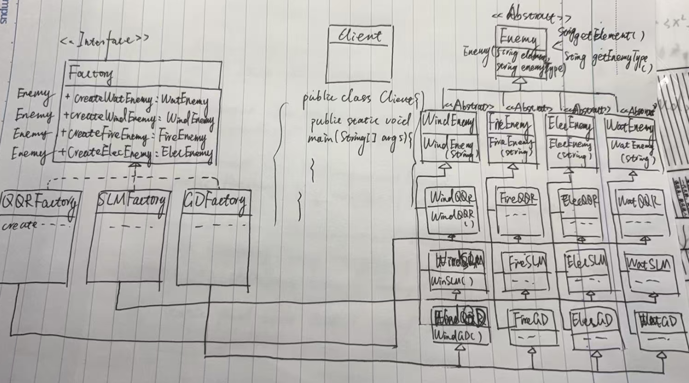

# VI  Adapter
**Adapter（适配器模式）**

**一句话：**  
当“现有类的接口”跟“客户端期望的接口”不同时，用一个适配器在中间转换，让原来的类可以在不修改代码的情况下被复用。

---

**核心角色**

- **Target（目标接口）**  
  客户端**期望**使用的接口形式。
- **Adaptee（被适配者）**  
  已经存在的类，功能有了，但接口“不对口”。
- **Adapter（适配器）**  
  同时依赖 Target 和 Adaptee：  
  对外实现 Target，对内转调 Adaptee，把调用“翻译”过去。
- **Client（客户端）**  
  只面向 Target 编程，通过 Adapter 间接使用 Adaptee。

---

**简单 Java 示例**

场景：客户端希望调用 `play(String fileName)` 播放 MP3，但现有库里只有一个 `AdvancedPlayer`，方法是 `playMp4`、`playAvi` 等。

```java
// 目标接口：客户端希望看到的统一接口
interface MediaPlayer {
    void play(String fileName);
}

// 已有类：接口不兼容
class AdvancedPlayer {
    void playMp4(String fileName) {
        System.out.println("播放 MP4: " + fileName);
    }

    void playAvi(String fileName) {
        System.out.println("播放 AVI: " + fileName);
    }
}

// 适配器：把 MediaPlayer 接口适配到 AdvancedPlayer
class MediaAdapter implements MediaPlayer {
    private AdvancedPlayer advancedPlayer = new AdvancedPlayer();

    @Override
    public void play(String fileName) {
        if (fileName.endsWith(".mp4")) {
            advancedPlayer.playMp4(fileName);
        } else if (fileName.endsWith(".avi")) {
            advancedPlayer.playAvi(fileName);
        } else {
            System.out.println("不支持的格式: " + fileName);
        }
    }
}

// 客户端
public class Client {
    public static void main(String[] args) {
        MediaPlayer player = new MediaAdapter();
        player.play("movie.mp4");
        player.play("demo.avi");
    }
}
```

这里：

- `MediaPlayer` 是 **Target**
- `AdvancedPlayer` 是 **Adaptee**
- `MediaAdapter` 是 **Adapter**
- `Client` 只认 `MediaPlayer`，不直接接触 `AdvancedPlayer`

---

**类图（对象适配器）**

```text
          +------------------------+
          |      MediaPlayer      | <<Target>>
          +------------------------+
          | + play(file:String)   |
          +------------------------+
                    ^
                    |
          +------------------------+
          |     MediaAdapter       | <<Adapter>>
          +------------------------+
          | - advancedPlayer:AdvancedPlayer |
          +------------------------+
          | + play(file:String)   |
          +------------------------+
                    |
          uses      |
                    v
          +------------------------+
          |    AdvancedPlayer      | <<Adaptee>>
          +------------------------+
          | + playMp4(file)       |
          | + playAvi(file)       |
          +------------------------+


          +------------------------+
          |        Client          |
          +------------------------+
          | + main(...)           |
          +------------------------+
                    |
                    | uses
                    v
               MediaPlayer
```

---

**两种常见形式**

- **对象适配器**（上面的例子）：Adapter 内部**组合**一个 Adaptee 对象（常用、灵活）。
- **类适配器**：Adapter 通过 `extends Adaptee` + `implements Target` 的方式适配（需要多重继承支持，Java 里不太常用）。

下面把你给的插头适配例子整理成“**适配器模式 示例2**”，然后画出类图。

---

**示例代码2：三孔插座适配两孔插头**

```java
public interface TriplePin {
    void electrify(int l, int n, int e);
}

public interface DualPin {
    void electrify(int l, int n);
}

public class TV implements DualPin {
    @Override
    public void electrify(int l, int n) {
        System.out.println("火线通电: " + l + "，零线通电: " + n);
        System.out.println("电视开始工作");
    }
}

public class Adapter implements TriplePin {
    private DualPin dualPinDevice;

    public Adapter(DualPin dualPinDevice) {
        this.dualPinDevice = dualPinDevice;
    }

    @Override
    public void electrify(int l, int n, int e) {
        System.out.println("使用适配器，忽略地线参数: " + e);
        dualPinDevice.electrify(l, n);
    }
}

public class AdapterClient {
    public static void main(String[] args) {
        DualPin tvDualPinDevice = new TV();
        TriplePin triplePinDevice = new Adapter(tvDualPinDevice);
        triplePinDevice.electrify(1, 0, -1);
    }
}
```

这段代码体现的是**对象适配器**：`Adapter` 组合了一个 `DualPin` 设备，把 `TriplePin` 调用转换成 `DualPin` 调用。

---

**类图（UML 文本表示）**

```text
             +-------------------------+
             |       TriplePin         | <<interface>>
             +-------------------------+
             | + electrify(l:int,      |
             |              n:int,     |
             |              e:int):void|
             +-------------------------+

             +-------------------------+
             |        DualPin          | <<interface>>
             +-------------------------+
             | + electrify(l:int,      |
             |              n:int):void|
             +-------------------------+

                              +-------------------------+
                              |          TV            |
                              +-------------------------+
                              |                         |
                              +-------------------------+
                              | + electrify(l,n): void  |
                              +-------------------------+
                                      ^
                                      |
                         implements   |
                         (realization)|
                    DualPin ─ ─ ─ ─ ──┘


                    +-------------------------------+
                    |           Adapter             |
                    +-------------------------------+
                    | - dualPinDevice: DualPin      |
                    +-------------------------------+
                    | + Adapter(dual:DualPin)       |
                    | + electrify(l,n,e): void      |
                    +-------------------------------+
                           ^                 |
                           | implements      | uses / has-a
                           | (realization)   v
                  TriplePin ─ ─ ─ ─ ─ ─ ─> DualPin


                    +-------------------------------+
                    |        AdapterClient          |
                    +-------------------------------+
                    | + main(args:String[]): void   |
                    +-------------------------------+
                               |
                               | uses
                               v
                         TriplePin, DualPin, TV, Adapter
```

**关系对应：**

- `TriplePin`、`DualPin`：目标接口 / 被适配接口
- `TV implements DualPin`：电视是两孔设备
- `Adapter implements TriplePin`，内部组合 `DualPin`：适配器把三孔接口“翻译”为两孔接口
- `AdapterClient`：
  - 面向 `TriplePin` 编程
  - 通过 `new Adapter(new TV())` 在三孔环境里复用两孔电视设备

# VII Decorator

**Decorator（装饰器模式）**

**一句话：**  
在不修改原有类、不改变对象类型的前提下，**在运行时“套一层一层壳”给对象动态增加功能**。

---

**核心思想**

- 原始对象实现某个接口（或抽象类），叫 **Component**。
- 装饰器也实现同一个接口，内部**组合一个 Component 对象**。
- 对外看起来还是这个接口类型，但行为在“转调用前后”被增强了。
- 可以多层嵌套：`new LoggingDecorator(new CompressionDecorator(new FileOutputStream(...)))`。
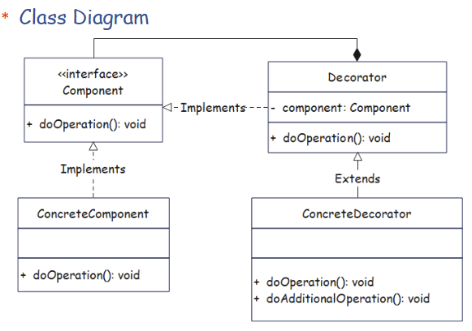
---

**角色**

- **Component（抽象组件）**  
  定义统一接口，比如 `operation()`、`read()`、`send()`。
- **ConcreteComponent（具体组件）**  
  原始对象，提供基础功能。
- **Decorator（抽象装饰器，可选）**  
  实现 Component，并持有一个 Component 引用，作为装饰器父类。
- **ConcreteDecorator（具体装饰器）**  
  在调用被包装对象前后增加新行为。

---

**简单 Java 示例：对“发送消息”进行装饰**

```java
interface Message {
    String getContent();
}

class SimpleMessage implements Message {
    private String content;

    public SimpleMessage(String content) {
        this.content = content;
    }

    @Override
    public String getContent() {
        return content;
    }
}

abstract class MessageDecorator implements Message {
    protected Message message;

    public MessageDecorator(Message message) {
        this.message = message;
    }
}

class HtmlMessageDecorator extends MessageDecorator {
    public HtmlMessageDecorator(Message message) {
        super(message);
    }

    @Override
    public String getContent() {
        return "<html>" + message.getContent() + "</html>";
    }
}

class EncryptionMessageDecorator extends MessageDecorator {
    public EncryptionMessageDecorator(Message message) {
        super(message);
    }

    @Override
    public String getContent() {
        String original = message.getContent();
        return new StringBuilder(original).reverse().toString();
    }
}

public class Client {
    public static void main(String[] args) {
        Message msg = new SimpleMessage("hello");
        msg = new HtmlMessageDecorator(msg);
        msg = new EncryptionMessageDecorator(msg);
        System.out.println(msg.getContent());
    }
}
```

调用顺序：

1. `SimpleMessage` 返回 `"hello"`。
2. `HtmlMessageDecorator` 把它包装成 `"<html>hello</html>"`。
3. `EncryptionMessageDecorator` 再把字符串“加密”（这里用反转代替），得到 `">lmth/<olleh>lmth<"`。

对象类型始终是 `Message`，但行为被一层层增强，这就是 Decorator。

---

**和继承的区别**

- 继承：在类定义阶段扩展行为，类一旦写死就很难组合变化。
- 装饰器：在对象使用阶段组合、叠加各种功能，灵活搭配。
- 当“可能的功能组合很多”时，用 Decorator 比“为每种组合写一个子类”要干净得多。

Please use the decoration mode to complete the ice cream order system, which
needs to include adding chocolate, adding jam, adding MM beans, and adding fruit
pieces. Vanilla base, coffee base, matcha base. (It is not necessary to write the
specific execution code, but the structure and client program need to be written).
---

**1. Component interface**

```java
// Component
public interface IceCream {
    String getDescription();
    double getCost();
}
```

---

**2. Concrete Components: base flavors**

```java
// ConcreteComponent: Vanilla base
public class VanillaBase implements IceCream {
    @Override
    public String getDescription() {
        return "Vanilla base";
    }

    @Override
    public double getCost() {
        return 10.0; // arbitrary base price
    }
}

// ConcreteComponent: Coffee base
public class CoffeeBase implements IceCream {
    @Override
    public String getDescription() {
        return "Coffee base";
    }

    @Override
    public double getCost() {
        return 11.0;
    }
}

// ConcreteComponent: Matcha base
public class MatchaBase implements IceCream {
    @Override
    public String getDescription() {
        return "Matcha base";
    }

    @Override
    public double getCost() {
        return 12.0;
    }
}
```

---

**3. Abstract Decorator**

```java
// Decorator
public abstract class IceCreamDecorator implements IceCream {
    protected IceCream inner;

    public IceCreamDecorator(IceCream inner) {
        this.inner = inner;
    }

    @Override
    public String getDescription() {
        return inner.getDescription();
    }

    @Override
    public double getCost() {
        return inner.getCost();
    }
}
```

---

**4. Concrete Decorators: toppings**

```java
// ConcreteDecorator: add chocolate
public class ChocolateDecorator extends IceCreamDecorator {
    public ChocolateDecorator(IceCream inner) {
        super(inner);
    }

    @Override
    public String getDescription() {
        return inner.getDescription() + " + chocolate";
    }

    @Override
    public double getCost() {
        return inner.getCost() + 2.0;
    }
}

// ConcreteDecorator: add jam
public class JamDecorator extends IceCreamDecorator {
    public JamDecorator(IceCream inner) {
        super(inner);
    }

    @Override
    public String getDescription() {
        return inner.getDescription() + " + jam";
    }

    @Override
    public double getCost() {
        return inner.getCost() + 1.5;
    }
}

// ConcreteDecorator: add M&M beans
public class MmBeansDecorator extends IceCreamDecorator {
    public MmBeansDecorator(IceCream inner) {
        super(inner);
    }

    @Override
    public String getDescription() {
        return inner.getDescription() + " + M&M beans";
    }

    @Override
    public double getCost() {
        return inner.getCost() + 2.5;
    }
}

// ConcreteDecorator: add fruit pieces
public class FruitDecorator extends IceCreamDecorator {
    public FruitDecorator(IceCream inner) {
        super(inner);
    }

    @Override
    public String getDescription() {
        return inner.getDescription() + " + fruit pieces";
    }

    @Override
    public double getCost() {
        return inner.getCost() + 3.0;
    }
}
```

---

**5. Client program (order examples)**

```java
public class IceCreamClient {
    public static void main(String[] args) {
        // Example 1: vanilla base + chocolate + jam
        IceCream order1 = new VanillaBase();
        order1 = new ChocolateDecorator(order1);
        order1 = new JamDecorator(order1);

        System.out.println(order1.getDescription());
        System.out.println("Total cost: " + order1.getCost());

        // Example 2: coffee base + M&M beans
        IceCream order2 = new CoffeeBase();
        order2 = new MmBeansDecorator(order2);

        System.out.println(order2.getDescription());
        System.out.println("Total cost: " + order2.getCost());

        // Example 3: matcha base + fruit pieces + chocolate + M&M beans
        IceCream order3 = new MatchaBase();
        order3 = new FruitDecorator(order3);
        order3 = new ChocolateDecorator(order3);
        order3 = new MmBeansDecorator(order3);

        System.out.println(order3.getDescription());
        System.out.println("Total cost: " + order3.getCost());
    }
}
```

---

**结构对应关系**

- `IceCream`：Component 接口
- `VanillaBase / CoffeeBase / MatchaBase`：ConcreteComponent，代表不同冰淇淋“基底”
- `IceCreamDecorator`：抽象 Decorator，统一持有一个 `IceCream` 引用
- `ChocolateDecorator / JamDecorator / MmBeansDecorator / FruitDecorator`：ConcreteDecorator，添加配料
- `IceCreamClient`：客户端，通过不断用装饰器“包裹”基底对象来组成订单

# VIII Command

**Command Pattern（命令模式）**

**一句话：**  
把“要做的事情”封装成一个对象（Command），让**请求的发出者**和**执行者**解耦，并且可以对这些“命令对象”排队、记录、撤销、重做等。

---

**1. 核心动机**

通常我们会这样写代码：

```java
button.onClick(() -> light.turnOn());
```

按钮直接调用电灯的方法，**按钮知道电灯是谁，也知道要调哪个方法**，耦合很紧。如果想：

- 一个按钮有时开灯、有时开门、有时播放音乐；
- 支持“撤销上一次操作”；
- 把操作记录成日志以后重放；

直接写 if-else 会越来越乱。  
命令模式的想法是：**把“开灯”这种请求包装成一个对象**，Button 只负责“触发命令”，不再关心命令具体干了什么。

---

**2. 角色**

- **Command（命令接口）**  
  抽象出统一的 `execute()` 方法，有时还会有 `undo()`。
- **ConcreteCommand（具体命令）**  
  内部持有一个“接收者”（Receiver），在 `execute` 里调用接收者的具体操作。
- **Receiver（接收者）**  
  真正干活的对象，比如 Light、TV、FileSystem。
- **Invoker（调用者）**  
  触发命令的地方，比如 Button、MenuItem、遥控器。
- **Client（客户端）**  
  负责装配：创建接收者、命令对象，并把命令塞给调用者。


---

**3. 简单 Java 示例：遥控器开灯 / 关灯**

```java
// 命令接口
interface Command {
    void execute();
}

// 接收者：电灯
class Light {
    public void turnOn() {
        System.out.println("Light ON");
    }

    public void turnOff() {
        System.out.println("Light OFF");
    }
}

// 具体命令：开灯
class LightOnCommand implements Command {
    private Light light;

    public LightOnCommand(Light light) {
        this.light = light;
    }

    @Override
    public void execute() {
        light.turnOn();
    }
}

// 具体命令：关灯
class LightOffCommand implements Command {
    private Light light;

    public LightOffCommand(Light light) {
        this.light = light;
    }

    @Override
    public void execute() {
        light.turnOff();
    }
}

// 调用者：遥控器按钮
class RemoteButton {
    private Command command;

    public RemoteButton(Command command) {
        this.command = command;
    }

    public void press() {
        command.execute();
    }
}

// 客户端：装配命令
public class Client {
    public static void main(String[] args) {
        Light light = new Light();

        Command onCommand = new LightOnCommand(light);
        Command offCommand = new LightOffCommand(light);

        RemoteButton onButton = new RemoteButton(onCommand);
        RemoteButton offButton = new RemoteButton(offCommand);

        onButton.press();   // Light ON
        offButton.press();  // Light OFF
    }
}
```

**关键点：**

- `RemoteButton` 只持有 `Command` 接口，不需要知道“灯”是谁。
- `LightOnCommand` / `LightOffCommand` 各自知道怎么操作 `Light`。
- 想把按钮改成“关灯”→只需要给按钮换一个命令对象。

---

**4. 类图关系（文字版）**

```text
           +-------------------+
           |     Command       | <<interface>>
           +-------------------+
           | + execute():void  |
           +-------------------+
                 ^        ^
                 |        |
   +----------------+  +------------------+
   | LightOnCommand |  | LightOffCommand  |
   +----------------+  +------------------+
   | - light:Light  |  | - light:Light    |
   +----------------+  +------------------+
   | + execute()    |  | + execute()      |
   +----------------+  +------------------+
             |               |
             | uses          | uses
             v               v
          +----------------------+
          |        Light         |
          +----------------------+
          | + turnOn()           |
          | + turnOff()          |
          +----------------------+


          +----------------------+
          |     RemoteButton     | <<Invoker>>
          +----------------------+
          | - command:Command    |
          +----------------------+
          | + press():void       |
          +----------------------+
                    ^
                    | uses
                    |
                 Command
```

---

**5. 命令模式适合用在**

- GUI 中：按钮、菜单项、快捷键绑定各种命令；
- 事务 / 操作日志：记录操作，支持撤销、重做；
- 任务队列：把要执行的操作封装成命令对象，投到队列里再慢慢执行；
- 宏命令：把多个命令组合成一个“批处理命令”。

# IX State
**State Pattern（状态模式）**

**一句话：**  
当一个对象在不同状态下要表现出**完全不同的行为**时，把这些“状态下的行为”封装成独立的状态类，让对象在内部切换“当前状态”，而不是在一个大 `if-else` / `switch` 里到处判断状态。

---

**1. 核心思想**

没有状态模式时，你可能这样写：

```java
class Context {
    private int state; // 0: Ready, 1: Running, 2: Paused ...

    public void handle() {
        if (state == 0) {
            // Ready 的行为
        } else if (state == 1) {
            // Running 的行为
        } else if (state == 2) {
            // Paused 的行为
        }
    }
}
```

- 状态越多，`if-else` 越长；
- 每加一个状态，都要改这个类的很多地方；
- 和 **Strategy** 不同的是：状态之间通常会**相互切换**（比如从 Ready → Running → Paused → Running → Stopped）。

状态模式把“每种状态下的行为”拆成类：

- `State` 接口：定义环境在某个状态下会对请求做什么；
- 每个状态类负责：**在当前状态下怎么处理请求 + 什么时候切换到下一个状态**。

---

**2. 角色**

- **State（状态接口）**  
  定义在不同状态下要响应的操作，比如 `handle()`、`play()`、`stop()` 等。
- **ConcreteState（具体状态类）**  
  实现状态接口，封装该状态下的具体行为，并在合适时机切换 `Context` 的当前状态。
- **Context（环境 / 上下文）**  
  持有一个 `State` 引用，所有对外行为都委托给当前 `state` 对象；  
  提供方法给状态类用来“切换状态”：`setState(...)`。

---

**3. 简单 Java 示例：电梯状态**

电梯有几种状态：停止（Stopped）、运行（Running）、故障（Broken），按下按钮时行为不同。

```java
// 状态接口
interface ElevatorState {
    void pressButton(Elevator context);
}

// 环境类
class Elevator {
    private ElevatorState state;

    public Elevator(ElevatorState initState) {
        this.state = initState;
    }

    public void setState(ElevatorState state) {
        this.state = state;
    }

    public void pressButton() {
        state.pressButton(this);
    }
}

// 具体状态：停止
class StoppedState implements ElevatorState {
    @Override
    public void pressButton(Elevator context) {
        System.out.println("电梯启动，开始运行");
        context.setState(new RunningState());
    }
}

// 具体状态：运行中
class RunningState implements ElevatorState {
    @Override
    public void pressButton(Elevator context) {
        System.out.println("电梯正在运行，忽略按钮");
        // 也可以在某些条件下切到其他状态
    }
}

// 具体状态：故障
class BrokenState implements ElevatorState {
    @Override
    public void pressButton(Elevator context) {
        System.out.println("电梯故障，无法响应");
    }
}

// 客户端
public class Client {
    public static void main(String[] args) {
        Elevator elevator = new Elevator(new StoppedState());

        elevator.pressButton(); // 启动 → RunningState
        elevator.pressButton(); // 运行中，忽略
        
        elevator.setState(new BrokenState());
        elevator.pressButton(); // 故障，无法响应
    }
}
```

**要点：**

- `Elevator` 不再用 `if (state == ...)` 决定行为；
- 每个状态类负责“本状态下该怎么干 + 要不要切换状态”；
- 想增加新状态时，只需加一个新的 `ConcreteState`，并在别的状态里决定是否切换过去。

---

**4. 和 Strategy / State 的区别（容易混）**

- **Strategy（策略模式）**  
  - 通常由客户端主动选择使用哪种算法/策略；
  - 策略之间一般**不会自己切换**。
- **State（状态模式）**  
  - 通常由对象内部根据业务流程**自动切换状态**；
  - 每个状态知道“下一步可能转到哪里”。

一句对比：  
> Strategy：同一事，不同做法，**外部选策略**。  
> State：同一对象，随状态变，**内部切状态**。

Here is a **cleaned State-pattern version** of your traffic‑light example, plus the **class diagram**.

---

**1. 整理后的代码结构**

```java
// State interface
public interface State {
    void switchToGreen(TrafficLight trafficLight);
    void switchToYellow(TrafficLight trafficLight);
    void switchToRed(TrafficLight trafficLight);
}

// Concrete state: Red
public class Red implements State {

    @Override
    public void switchToGreen(TrafficLight trafficLight) {
        System.out.println("ERROR!!! 红灯不能直接切换为绿灯。");
    }

    @Override
    public void switchToYellow(TrafficLight trafficLight) {
        trafficLight.setState(new Yellow());
        System.out.println("OK... 红灯结束，黄灯准备 5 秒。");
    }

    @Override
    public void switchToRed(TrafficLight trafficLight) {
        System.out.println("ERROR!!! 已经是红灯，无需再次切换。");
    }
}

// Concrete state: Green
public class Green implements State {

    @Override
    public void switchToGreen(TrafficLight trafficLight) {
        System.out.println("ERROR!!! 已经是绿灯，无需再次切换。");
    }

    @Override
    public void switchToYellow(TrafficLight trafficLight) {
        trafficLight.setState(new Yellow());
        System.out.println("OK... 绿灯结束，黄灯亮起 5 秒。");
    }

    @Override
    public void switchToRed(TrafficLight trafficLight) {
        System.out.println("ERROR!!! 绿灯不能直接切换为红灯。");
    }
}

// Concrete state: Yellow
public class Yellow implements State {

    @Override
    public void switchToGreen(TrafficLight trafficLight) {
        trafficLight.setState(new Green());
        System.out.println("OK... 黄灯结束，切换为绿灯。");
    }

    @Override
    public void switchToYellow(TrafficLight trafficLight) {
        System.out.println("ERROR!!! 已经是黄灯，无需再次切换。");
    }

    @Override
    public void switchToRed(TrafficLight trafficLight) {
        trafficLight.setState(new Red());
        System.out.println("OK... 黄灯结束，切换为红灯。");
    }
}

// Context
public class TrafficLight {
    private State state = new Red();  // 初始状态：红灯

    public void setState(State state) {
        this.state = state;
    }

    public void switchToGreen() {
        state.switchToGreen(this);
    }

    public void switchToYellow() {
        state.switchToYellow(this);
    }

    public void switchToRed() {
        state.switchToRed(this);
    }
}

// Client
public class TrafficLightClient {
    public static void main(String[] args) {
        TrafficLight trafficLight = new TrafficLight();

        trafficLight.switchToYellow(); // 红 -> 黄
        trafficLight.switchToGreen();  // 黄 -> 绿
        trafficLight.switchToYellow(); // 绿 -> 黄
        trafficLight.switchToRed();    // 黄 -> 红
        trafficLight.switchToGreen();  // 红 -> 绿（错误示例）
    }
}
```

关键点：

- **状态判断全部放到状态类里**（Red/Green/Yellow），`TrafficLight` 不写 if/else。
- 状态切换通过 `trafficLight.setState(new Xxx())` 完成。
- `TrafficLight` 对外只提供 `switchToGreen/Yellow/Red()`，具体行为由当前 `state` 决定。

---


---

**1. 先看接口：所有状态都必须实现的操作**

```java
public interface State {
    void switchToGreen(TrafficLight trafficLight);
    void switchToYellow(TrafficLight trafficLight);
    void switchToRed(TrafficLight trafficLight);
}
```

含义：

- 这是“**状态接口**”，描述在某种状态下，**如果有人要求切成绿/黄/红灯，该怎么处理**。
- 每个具体状态类（Red、Green、Yellow）都要实现这 3 个方法。
- 每个方法都接收 `TrafficLight trafficLight`，是为了：
  - 在内部可以调用 `trafficLight.setState(...)` 来**修改交通灯当前状态**。

---

**2. 具体状态：Red / Green / Yellow**

以 `Red` 为例：

```java
public class Red implements State {

    @Override
    public void switchToGreen(TrafficLight trafficLight) {
        System.out.println("ERROR!!! 红灯不能直接切换为绿灯。");
    }

    @Override
    public void switchToYellow(TrafficLight trafficLight) {
        trafficLight.setState(new Yellow());
        System.out.println("OK... 红灯结束，黄灯准备 5 秒。");
    }

    @Override
    public void switchToRed(TrafficLight trafficLight) {
        System.out.println("ERROR!!! 已经是红灯，无需再次切换。");
    }
}
```

- 当前是**红灯状态**时：
  - 调 `switchToGreen`：打印错误提示，不允许红→绿。
  - 调 `switchToYellow`：允许红→黄：
    - `trafficLight.setState(new Yellow());` 把上下文状态切成 `Yellow`；
    - 打印“红灯结束，黄灯准备……”
  - 调 `switchToRed`：已经是红灯，再切红灯是无效操作，打印错误。

`Green` 和 `Yellow` 类同理，只是规则不同：

- `Green`：
  - 不能直接绿→红；
  - 可以绿→黄（`setState(new Yellow())`），表示绿灯结束，黄灯缓冲。
- `Yellow`：
  - 可以黄→绿，也可以黄→红（根据你设计的流程）；
  - 已经是黄灯就不能再切黄。

**关键点：**  
每个状态类“知道自己在当前状态下，哪些切换是允许的，哪些是错误的，并负责在允许时修改 TrafficLight 的状态”。

---

**3. 环境类 TrafficLight：持有当前状态**

```java
public class TrafficLight {
    private State state = new Red();  // 初始状态：红灯

    public void setState(State state) {
        this.state = state;
    }

    public void switchToGreen() {
        state.switchToGreen(this);
    }

    public void switchToYellow() {
        state.switchToYellow(this);
    }

    public void switchToRed() {
        state.switchToRed(this);
    }
}
```

作用：

- `TrafficLight` 是**上下文(Context)**，代表一个现实中的红绿灯。
- 内部有一个 `State state` 字段：
  - 一开始设为 `new Red()`，表示刚创建时是红灯。
- 对外暴露三个方法：
  - `switchToGreen()` / `switchToYellow()` / `switchToRed()`
- 但它自己**不做任何逻辑判断**，只把请求转发给当前状态对象：
  - `state.switchToGreen(this);`  
  - 参数 `this` 传进去，让状态有机会调用 `setState` 修改当前状态。

**这就是状态模式最关键的一点：**

> TrafficLight 不用 `if (state == RED)` 之类的判断，  
> 把“在当前状态下要做什么”完全交给 `state` 对象。

---

**4. 客户端：模拟状态切换过程**

```java
public class TrafficLightClient {
    public static void main(String[] args) {
        TrafficLight trafficLight = new TrafficLight();

        trafficLight.switchToYellow(); // 红 -> 黄
        trafficLight.switchToGreen();  // 黄 -> 绿
        trafficLight.switchToYellow(); // 绿 -> 黄
        trafficLight.switchToRed();    // 黄 -> 红
        trafficLight.switchToGreen();  // 红 -> 绿（这里会报 ERROR）
    }
}
```

执行流程大概是：

1. 创建 `TrafficLight`，内部 `state = new Red()`。
2. `trafficLight.switchToYellow();`
   - 当前 `state` 是 `Red` → 调 `Red.switchToYellow(this)`：
     - 允许：`setState(new Yellow())`，并打印“红灯结束，黄灯准备 5 秒。”
3. `trafficLight.switchToGreen();`
   - 当前 `state` 已是 `Yellow` → 调 `Yellow.switchToGreen(this)`：
     - 允许：`setState(new Green())`，打印“黄灯结束，切换为绿灯。”
4. 接下来依次类似，最终再 `switchToGreen()` 时：
   - 如果当前是 `Red`，调用 `Red.switchToGreen(this)`，会输出“ERROR!!! 红灯不能直接切换为绿灯。”

---

**5. 总结一下这个例子体现的 State 模式**

- **State 接口**：定义红灯、绿灯、黄灯“在自己状态下”如何响应“切换请求”。
- **Red/Green/Yellow**：  
  - 决定当前状态允许什么、不允许什么；  
  - 在适当时机调用 `trafficLight.setState(...)` 切换到下一个状态。
- **TrafficLight（Context）**：只持有当前 `State`，对外提供统一的切换方法，不写 if-else。
- **Client**：只是按业务顺序调用 `switchToXXX`，不关心内部状态逻辑。


**2. 类图（文本 UML）**

```text
                 +------------------------+
                 |         State          | <<interface>>
                 +------------------------+
                 | + switchToGreen(tl)    |
                 | + switchToYellow(tl)   |
                 | + switchToRed(tl)      |
                 +------------------------+
                    ^          ^          ^
                    |          |          |
          +---------------+  +---------------+  +---------------+
          |      Red      |  |     Green     |  |    Yellow     |
          +---------------+  +---------------+  +---------------+
          |               |  |               |  |               |
          +---------------+  +---------------+  +---------------+
          | + switchTo... |  | + switchTo... |  | + switchTo... |
          +---------------+  +---------------+  +---------------+
                    \           |           /
                     \          |          /
                      \         |         /
                       \        |        /
                        v       v       v

                 +----------------------------+
                 |       TrafficLight         |  <<Context>>
                 +----------------------------+
                 | - state: State             |
                 +----------------------------+
                 | + setState(State)          |
                 | + switchToGreen()          |
                 | + switchToYellow()         |
                 | + switchToRed()            |
                 +----------------------------+


                 +----------------------------+
                 |    TrafficLightClient      | <<Client>>
                 +----------------------------+
                 | + main(args:String[]):void |
                 +----------------------------+
                             |
                             | uses
                             v
                       TrafficLight
```

- `State` 是状态接口；
- `Red`、`Green`、`Yellow` 实现 `State`，封装每种灯光状态下的行为和状态切换；
- `TrafficLight` 持有当前 `State`，对外暴露切换方法；
- `TrafficLightClient` 只是按顺序调用这些方法来模拟状态变化。

# X Template Method

**Template Method（模板方法模式）**

**一句话：**  
在抽象父类里定义一个**算法的固定步骤（模板方法）**，把其中一些步骤的具体实现**推迟到子类**去完成，这样既能复用整体流程，又能让不同子类定制细节。

---

**1. 核心思想**

- 有一类操作，它们的**执行流程是一样的**，但某些步骤的实现细节不一样。
- 比如：
  - 读取文件：打开文件 → 读取内容 → 关闭文件  
    不同子类可能“怎么解析内容”不同。
  - 做菜：备料 → 烹饪 → 装盘  
    不同菜的具体备料、烹饪方法不一样，但流程一样。

模板方法模式做两件事：

1. 在父类中写好“算法骨架（模板方法）”，把步骤按顺序写死。
2. 把某些步骤定义成抽象方法，交由子类去实现。

---

**2. 角色**

- **AbstractClass（抽象类）**
  - 包含一个 `final` 的模板方法，比如 `doJob()`；
  - 在模板方法中，按照固定顺序调用若干步骤方法；
  - 这些步骤中，有的可以是具体方法，有的是抽象方法。
- **ConcreteClass（具体子类）**
  - 实现抽象步骤，定制每一步的具体行为。
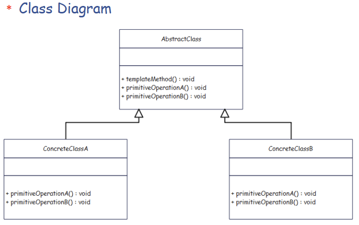
---

**3. 简单 Java 示例：制作饮品**

```java
// 抽象类：饮品制作流程
public abstract class Beverage {
    // 模板方法：控制整个制作流程
    public final void make() {
        boilWater();
        brew();
        pourInCup();
        addCondiments();
    }

    private void boilWater() {
        System.out.println("Boiling water");
    }

    private void pourInCup() {
        System.out.println("Pouring into cup");
    }

    // 需要子类实现的步骤
    protected abstract void brew();          // 冲泡方式：咖啡/茶 不同
    protected abstract void addCondiments(); // 添加的佐料：糖/牛奶/柠檬 不同
}

// 具体子类：咖啡
public class Coffee extends Beverage {
    @Override
    protected void brew() {
        System.out.println("Dripping coffee through filter");
    }

    @Override
    protected void addCondiments() {
        System.out.println("Adding sugar and milk");
    }
}

// 具体子类：茶
public class Tea extends Beverage {
    @Override
    protected void brew() {
        System.out.println("Steeping the tea");
    }

    @Override
    protected void addCondiments() {
        System.out.println("Adding lemon");
    }
}

// 客户端
public class Client {
    public static void main(String[] args) {
        Beverage coffee = new Coffee();
        coffee.make();

        System.out.println("-----");

        Beverage tea = new Tea();
        tea.make();
    }
}
```

执行 `make()` 的流程对两种饮品完全一样：

1. `boilWater()`
2. `brew()`
3. `pourInCup()`
4. `addCondiments()`

但具体执行第 2、4 步时，由不同子类提供不同实现，达到了“**流程统一，细节多态**”。

---

# XI Builder

**Builder Pattern（建造者模式）**

**一句话：**  
把一个“复杂对象”的构建过程**分步骤拆开**，用 Builder 逐步设置各个部分，最后再一次性 `build()` 出来，避免巨大的构造函数和乱七八糟的 setter。

---

**1. 核心动机**

常见痛点：

```java
// 构造参数很多，很难记顺序
new User("Tom", 18, "Shanghai", true, "123456", "desc...", ...);
```

- 参数多、顺序难记，可读性很差；
- 有些字段是必填，有些是可选；
- 对象构造过程可能比较复杂（内部还要组装子对象）。

Builder 的做法：

- 把创建对象的过程封装到一个 **Builder 类** 里；
- 用一系列 `setXxx(...)` / `withXxx(...)` 来逐步配置；
- 最后调用 `build()` 返回目标对象。

---

**2. 经典角色（GoF 版本）**

- **Product（产品）**  
  被创建的复杂对象。
- **Builder（抽象建造者）**  
  定义创建产品各个部分的接口。
- **ConcreteBuilder（具体建造者）**  
  实现创建各部分的具体过程，并在内部维护一个 `Product`。
- **Director（指挥者，可选）**  
  负责“按某种顺序”调用 Builder 的各个步骤，封装出“构建流程”。
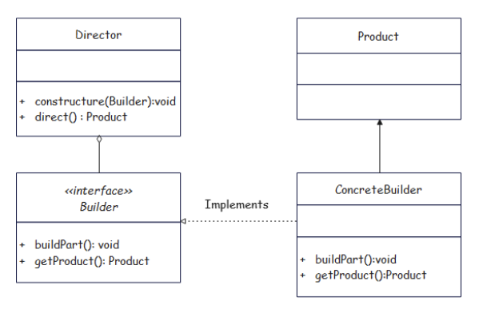
在现代 Java 里，更常见的是“流式 Builder”，不一定严格分 Director。

---

**3. 简单 Java 示例：构建一份复杂的 `Computer`**

```java
// Product
public class Computer {
    private String cpu;
    private String ram;
    private String storage;
    private String gpu;
    private boolean wifiEnabled;

    // 私有构造，只允许通过 Builder 创建
    private Computer(Builder builder) {
        this.cpu = builder.cpu;
        this.ram = builder.ram;
        this.storage = builder.storage;
        this.gpu = builder.gpu;
        this.wifiEnabled = builder.wifiEnabled;
    }

    // 静态内部 Builder
    public static class Builder {
        private String cpu;
        private String ram;
        private String storage;
        private String gpu;
        private boolean wifiEnabled;

        public Builder cpu(String cpu) {
            this.cpu = cpu;
            return this;
        }

        public Builder ram(String ram) {
            this.ram = ram;
            return this;
        }

        public Builder storage(String storage) {
            this.storage = storage;
            return this;
        }

        public Builder gpu(String gpu) {
            this.gpu = gpu;
            return this;
        }

        public Builder wifiEnabled(boolean wifiEnabled) {
            this.wifiEnabled = wifiEnabled;
            return this;
        }

        public Computer build() {
            // 这里可以做参数校验、默认值处理等
            return new Computer(this);
        }
    }
}
```

**客户端使用：**

```java
public class Client {
    public static void main(String[] args) {
        Computer gamePc = new Computer.Builder()
                .cpu("i7")
                .ram("16GB")
                .storage("1TB SSD")
                .gpu("RTX 4070")
                .wifiEnabled(true)
                .build();

        Computer officePc = new Computer.Builder()
                .cpu("i5")
                .ram("8GB")
                .storage("512GB SSD")
                .build(); // 不配 GPU / WiFi
    }
}
```

特点：

- 可读性很高：一眼能看出配置了什么；
- 参数顺序不再重要；
- 可选字段可以不调用对应方法。

---

**4. 和 Abstract Factory 的区别（刚学过）**

- **Builder**：关注的是**“一步一步把一个对象拼好”**的过程  
  - 特别适用于“一个对象内部结构复杂、构造过程有顺序”的场景。
- **Abstract Factory**：关注的是**“创建一族相关但彼此独立的对象”**  
  - 比如同一套 UI 组件：Button + TextField + Menu。

一句对比：

> Builder：一步步“搭”出一台电脑 / 一份套餐。  
> Abstract Factory：一下子“拿”来一整套同风格的产品族。

---

**一、代码**

```java
import java.util.ArrayList;
import java.util.List;

public class Building {
    private List<String> buildingComponents = new ArrayList<>();

    public void setBasement(String basement) {
        this.buildingComponents.add(basement);
    }

    public void setWall(String wall) {
        this.buildingComponents.add(wall);
    }

    public void setRoof(String roof) {
        this.buildingComponents.add(roof);
    }

    @Override
    public String toString() {
        String buildingStr = "";
        for (int i = buildingComponents.size() - 1; i >= 0; i--) {
            buildingStr += buildingComponents.get(i);
        }
        return buildingStr;
    }
}
```

```java
public interface Builder {
    void buildBasement();
    void buildWall();
    void buildRoof();
    Building getBuilding();
}
```

```java
public class HouseBuilder implements Builder {
    private Building house;

    public HouseBuilder() {
        house = new Building();
    }

    @Override
    public void buildBasement() {
        System.out.println("开始建造住宅地基");
        house.setBasement("住宅地基\n");
    }

    @Override
    public void buildWall() {
        System.out.println("开始建造住宅墙体");
        house.setWall("住宅墙体\n");
    }

    @Override
    public void buildRoof() {
        System.out.println("开始建造住宅屋顶");
        house.setRoof("住宅屋顶\n");
    }

    @Override
    public Building getBuilding() {
        return house;
    }
}
```

```java
public class ApartmentBuilder implements Builder {
    private Building apartment;

    public ApartmentBuilder() {
        apartment = new Building();
    }

    @Override
    public void buildBasement() {
        System.out.println("开始建造公寓地基");
        apartment.setBasement("公寓地基\n");
    }

    @Override
    public void buildWall() {
        System.out.println("开始建造公寓墙体");
        for (int i = 0; i < 6; i++) {
            apartment.setWall("公寓墙体\n");
        }
    }

    @Override
    public void buildRoof() {
        System.out.println("开始建造公寓屋顶");
        apartment.setRoof("公寓屋顶\n");
    }

    @Override
    public Building getBuilding() {
        return apartment;
    }
}
```

```java
public class Director {
    private Builder builder;

    public Director(Builder builder) {
        this.builder = builder;
    }

    public void setBuilder(Builder builder) {
        this.builder = builder;
    }

    public Building direct() {
        System.out.println("=== 工程启动 ===");
        builder.buildBasement();
        builder.buildWall();
        builder.buildRoof();
        System.out.println("=== 工程结束 ===");
        return builder.getBuilding();
    }
}
```

```java
public class Client {
    public static void main(String[] args) {
        Director director = new Director(new HouseBuilder());
        System.out.println(director.direct());

        director.setBuilder(new ApartmentBuilder());
        System.out.println(director.direct());
    }
}
```

---

**二、类图（文本 UML）**

```text
                  +----------------------+
                  |       Building       |  <<Product>>
                  +----------------------+
                  | - buildingComponents:List<String> |
                  +----------------------+
                  | + setBasement(String)|
                  | + setWall(String)    |
                  | + setRoof(String)    |
                  | + toString():String  |
                  +----------------------+

                  +----------------------+
                  |       Builder        |  <<interface>>
                  +----------------------+
                  | + buildBasement()    |
                  | + buildWall()        |
                  | + buildRoof()        |
                  | + getBuilding():Building |
                  +----------------------+
                       ^             ^
                       |             |
        +---------------------+  +----------------------+
        |    HouseBuilder     |  |   ApartmentBuilder   |
        +---------------------+  +----------------------+
        | - house:Building    |  | - apartment:Building |
        +---------------------+  +----------------------+
        | + buildBasement()   |  | + buildBasement()    |
        | + buildWall()       |  | + buildWall()        |
        | + buildRoof()       |  | + buildRoof()        |
        | + getBuilding()     |  | + getBuilding()      |
        +---------------------+  +----------------------+
                 |                        |
               uses                     uses
                 v                        v
             Building                 Building


                  +----------------------+
                  |       Director       |
                  +----------------------+
                  | - builder:Builder    |
                  +----------------------+
                  | + Director(Builder)  |
                  | + setBuilder(Builder)|
                  | + direct():Building  |
                  +----------------------+
                             ^
                             |
                   uses      |
                             v
                          Builder


                  +----------------------+
                  |        Client        |
                  +----------------------+
                  | + main(args)         |
                  +----------------------+
                             |
                             | uses
                             v
                         Director
```

---

**三、代码解释（结合 Builder 模式角色）**

1. **Product：Building**

   - `Building` 是最终要得到的“复杂对象”：一栋建筑。
   - 内部用 `List<String> buildingComponents` 存每一部分：地基、墙、屋顶等。
   - `setBasement` / `setWall` / `setRoof` 分别往列表里加组件描述。
   - `toString()` 把列表从后往前拼成一个字符串，用来打印建筑的结构。

2. **Builder 接口**

   - `Builder` 定义了“建造一栋楼”的几个步骤：
     - `buildBasement()`：建地基
     - `buildWall()`：建墙
     - `buildRoof()`：建屋顶
     - `getBuilding()`：返回最终建好的 `Building`
   - 这就是建造流程中“每一步”的抽象定义。

3. **ConcreteBuilder：HouseBuilder / ApartmentBuilder**

   - 两者都实现 `Builder`，但内部细节不同。

   - `HouseBuilder`：
     - 持有一个 `Building house`；
     - 在 `buildBasement` 中设置“住宅地基”，打印提示；
     - 在 `buildWall` 中设置“住宅墙体”；
     - 在 `buildRoof` 中设置“住宅屋顶”；
     - `getBuilding()` 返回这栋住宅。

   - `ApartmentBuilder`：
     - 持有 `Building apartment`；
     - `buildBasement` 设置“公寓地基”；
     - `buildWall` 中用循环多次添加“公寓墙体”，表示有很多层/单元；
     - `buildRoof` 设置“公寓屋顶”；
     - `getBuilding()` 返回这栋公寓。

   这体现了 Builder 模式的关键：**同样的建造步骤，不同的具体 Builder 产出的建筑不一样**。

4. **Director：封装建造流程**

   - `Director` 持有一个 `Builder builder`。
   - `direct()` 方法描述了“建房流程”的固定顺序：
     1. `buildBasement()`
     2. `buildWall()`
     3. `buildRoof()`
     4. 最后从 builder 中拿成品 `getBuilding()`
   - 通过 `setBuilder` 可以在运行时更换 Builder，从而在**相同流程**下建造不同类型的建筑（住宅/公寓）。

5. **Client：使用方**

   - 在 `main` 中：
     - 先创建 `Director`，传入 `new HouseBuilder()`；
       - 调用 `director.direct()`，得到一栋住宅，并打印其结构。
     - 然后 `setBuilder(new ApartmentBuilder())`；
       - 再 `direct()` 一次，这次得到的是公寓的结构。
   - 客户端只关心：
     - “我要调用 `direct()` 建一栋楼”
   - 不需要关心：
     - 具体每一步怎么实现，墙建多少层，屋顶怎么画。这些细节都藏在具体 Builder 里。

---

**总结**

- `Building`：要创建的复杂对象。
- `Builder`：定义建造步骤的接口。
- `HouseBuilder` / `ApartmentBuilder`：在同样步骤下，给出不同的建造细节。
- `Director`：固定好“建造顺序”，对外提供 `direct()`。
- `Client`：选择不同的 Builder，让同一个 `Director` 按统一流程构造不同风格的建筑。

# XII Prototype

**Prototype Pattern（原型模式）**

**一句话：**  
当创建一个对象“很贵”或“很复杂”时，不再每次 `new`，而是先准备一个**原型对象**，通过**克隆（clone）**来快速复制出新对象，然后再做微调。

---

**1. 核心动机**

- 某些对象的创建成本高：
  - 配置很多属性；
  - 需要访问数据库 / 网络 / 复杂计算；
- 这些对象之间很相似，只是某些字段不同。
- 与其每次从零开始 new，不如：
  1. 先有一个“已经配置好的”样板（Prototype）；
  2. 通过克隆复制出新对象；
  3. 按需改几个属性。

---

**2. 典型结构**

- **Prototype（原型接口）**
  - 声明 `clone()` 方法，返回自身类型的副本。
- **ConcretePrototype（具体原型类）**
  - 实现 `clone()`，完成对象复制（浅拷贝 / 深拷贝）。
- **Client（客户端）**
  - 持有一个或多个原型实例；
  - 需要新对象时调用原型的 `clone()`，而不是 `new`。

在 Java 中通常会结合 `Cloneable` 接口使用，也可以自定义克隆方法，不必必须用 `Object.clone()`。

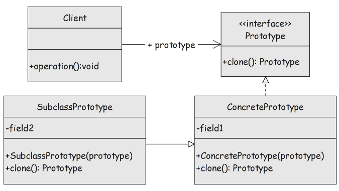
---

**3. 简单 Java 示例**

假设我们有一个比较复杂的图形类 `Shape`：

```java
// 原型接口
interface Prototype<T> {
    T clonePrototype();
}
```

```java
// 具体原型
public class Shape implements Prototype<Shape> {
    private String type;
    private int x;
    private int y;
    private String color;

    public Shape(String type, int x, int y, String color) {
        this.type = type;
        this.x = x;
        this.y = y;
        this.color = color;
    }

    // 原型克隆方法
    @Override
    public Shape clonePrototype() {
        // 浅拷贝：字段都是基本类型或不可变类型，直接 new 一个即可
        return new Shape(this.type, this.x, this.y, this.color);
    }

    // 省略 getter / setter / toString 等
}
```

客户端使用：

```java
public class Client {
    public static void main(String[] args) {
        // 准备一个“模板”圆形
        Shape circlePrototype = new Shape("circle", 0, 0, "red");

        // 克隆出多个相似的对象
        Shape circle1 = circlePrototype.clonePrototype();
        circle1.setX(10);
        circle1.setY(20);

        Shape circle2 = circlePrototype.clonePrototype();
        circle2.setX(30);
        circle2.setY(40);

        System.out.println(circle1);
        System.out.println(circle2);
    }
}
```

- 创建模板只做一次：`circlePrototype`
- 之后所有圆形都通过 `clonePrototype()` 来复制，再修改少量属性完成个性化。

---

**4. 浅拷贝 vs 深拷贝（面试常问）**

- **浅拷贝（shallow copy）**
  - 复制对象本身，但内部引用字段只复制引用，不复制引用指向的对象。
  - 适合内部字段是基本类型或不可变对象（String、Integer 等）时。
- **深拷贝（deep copy）**
  - 不仅复制对象自己，还复制它所引用的其他对象；
  - 克隆后的对象与原对象完全独立，互不影响；
  - 实现方式可以是：
    - 逐个字段手动 `clone`
    - 序列化再反序列化等。

---

# XIII Proxy

**Proxy Pattern（代理模式）**

**一句话：**  
在不改变原有对象的前提下，用一个“代理对象”来控制对它的访问，可以在前后加上权限校验、日志、缓存、远程调用等功能。

---

**1. 核心角色**

- **Subject（抽象主题）**  
  对外暴露的统一接口，比如 `request()`。
- **RealSubject（真实主题）**  
  真正干活的对象，包含核心业务逻辑。
- **Proxy（代理）**  
  实现同样的接口，内部持有一个 `RealSubject`；  
  在 `request()` 里做一些额外工作，再转调 `realSubject.request()`。
- **Client（客户端）**  
  面向 `Subject` 编程，可以不关心自己拿到的是“真身”还是“代理”。

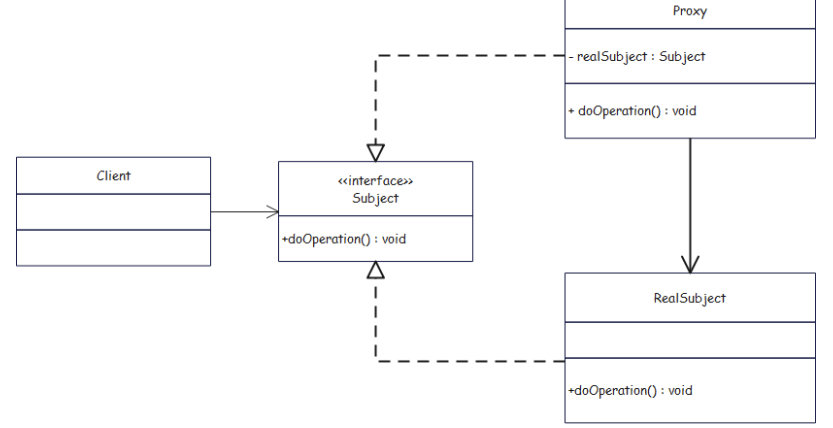
---

**2. 简单 Java 示例：带权限检查的代理**

```java
// 抽象主题
interface Service {
    void request(String user);
}

// 真实主题：真正的业务服务
class RealService implements Service {
    @Override
    public void request(String user) {
        System.out.println("执行真实业务逻辑，用户：" + user);
    }
}

// 代理：在调用真实服务前做权限控制
class ServiceProxy implements Service {
    private RealService realService = new RealService();

    @Override
    public void request(String user) {
        if (checkAccess(user)) {
            System.out.println("权限校验通过，进入真实服务");
            realService.request(user);
        } else {
            System.out.println("权限校验失败，拒绝访问：" + user);
        }
    }

    private boolean checkAccess(String user) {
        return "admin".equals(user); // 简单模拟：只有 admin 有权限
    }
}

// 客户端
public class Client {
    public static void main(String[] args) {
        Service service = new ServiceProxy();

        service.request("guest"); // 被代理拦截，拒绝
        service.request("admin"); // 通过代理，调用真实服务
    }
}
```

---

**3. 类图（文字版）**

```text
         +--------------------+
         |      Service       | <<interface>>
         +--------------------+
         | + request(user)    |
         +--------------------+
            ^             ^
            |             |
   +----------------+  +-----------------+
   |  RealService   |  |   ServiceProxy  |
   +----------------+  +-----------------+
   |                |  | - real:RealService |
   +----------------+  +-----------------+
   | + request()    |  | + request()     |
   +----------------+  +-----------------+
                          |
                          | uses
                          v
                     RealService

+----------------+
|    Client      |
+----------------+
| + main()       |
+----------------+
       |
       | uses
       v
    Service
```

---

**4. 常见使用场景**

- **远程代理**：本地对象代理远程服务（RMI、RPC）。
- **虚拟代理**：对象创建成本很高（如大图片），代理负责“按需创建 / 延迟加载”。
- **保护代理**：在访问真实对象前做权限控制（上面例子）。
- **智能引用**：在访问真实对象前后自动加上引用计数、日志、缓存等。

---

**5. 和 Decorator 的区别（容易混）**

- **Proxy** 的主要目的：**控制访问**（权限、远程、懒加载……）。  
- **Decorator** 的主要目的：**增强功能**（加新行为、叠加责任）。

两者结构很像——都“包一个对象再转发调用”，但意图不同：  
> Proxy 更像“看门的”；Decorator 更像“加装备的”。

# XIV Chain of Responsibility

**Chain of Responsibility（职责链模式）**

**一句话：**  
让**多个处理者对象**排成一条链，请求沿着链依次传递；每个处理者决定“自己处理”还是“交给下一个”，从而**解耦请求发送者和多个接收者之间的关系**。

---

**1. 解决什么问题**

没有职责链时经常这样写：

```java
void handle(Request r) {
    if (canByLeader(r)) {
        // leader 处理
    } else if (canByManager(r)) {
        // manager 处理
    } else if (canByBoss(r)) {
        // boss 处理
    }
}
```

- 所有处理逻辑都耦在一个方法里；
- 要增加/修改一个处理者时，要改这个大方法。

职责链做的事：

- 把每个“处理者”单独做成一个类；
- 让它们串成链：`handler1 -> handler2 -> handler3`；
- 请求先给第一个 handler，处理不了就往下传。

---

**2. 典型角色**

- **Handler（抽象处理者）**
  - 声明处理请求的接口，例如 `handleRequest()`；
  - 持有对“下一个处理者”的引用。
- **ConcreteHandler（具体处理者）**
  - 实现处理逻辑；
  - 能处理就处理，不能处理就把请求交给 `next`。
- **Client（客户端）**
  - 负责把一条链“串起来”；
  - 把请求扔给链头。

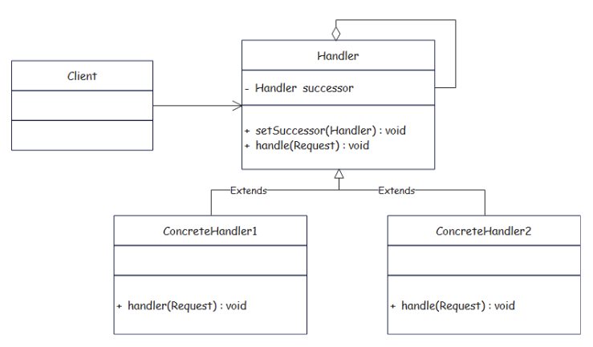
---

**3. 简单 Java 示例：请假审批**

规则示例：

- 组长可以审批 ≤ 1 天；
- 经理可以审批 ≤ 3 天；
- 老板审批 > 3 天。

```java
// 请求对象
class LeaveRequest {
    private String name;
    private int days;

    public LeaveRequest(String name, int days) {
        this.name = name;
        this.days = days;
    }

    public String getName() {
        return name;
    }

    public int getDays() {
        return days;
    }
}

// 抽象处理者
abstract class LeaveHandler {
    protected LeaveHandler next;

    public void setNext(LeaveHandler next) {
        this.next = next;
    }

    public abstract void handle(LeaveRequest request);
}

// 组长
class GroupLeader extends LeaveHandler {
    @Override
    public void handle(LeaveRequest request) {
        if (request.getDays() <= 1) {
            System.out.println("组长批准 " + request.getName() + " 请假 " + request.getDays() + " 天");
        } else if (next != null) {
            next.handle(request);
        }
    }
}

// 经理
class Manager extends LeaveHandler {
    @Override
    public void handle(LeaveRequest request) {
        if (request.getDays() <= 3) {
            System.out.println("经理批准 " + request.getName() + " 请假 " + request.getDays() + " 天");
        } else if (next != null) {
            next.handle(request);
        }
    }
}

// 老板
class Boss extends LeaveHandler {
    @Override
    public void handle(LeaveRequest request) {
        System.out.println("老板批准 " + request.getName() + " 请假 " + request.getDays() + " 天");
    }
}

// 客户端
public class Client {
    public static void main(String[] args) {
        LeaveHandler leader = new GroupLeader();
        LeaveHandler manager = new Manager();
        LeaveHandler boss = new Boss();

        // 串成职责链：leader -> manager -> boss
        leader.setNext(manager);
        manager.setNext(boss);

        LeaveRequest r1 = new LeaveRequest("小王", 1);
        LeaveRequest r2 = new LeaveRequest("小李", 2);
        LeaveRequest r3 = new LeaveRequest("小张", 5);

        leader.handle(r1); // 组长处理
        leader.handle(r2); // 转给经理处理
        leader.handle(r3); // 转给经理，再转给老板
    }
}
```

---

**4. 类图（文字版）**

```text
                 +------------------------+
                 |     LeaveHandler       | <<abstract>>
                 +------------------------+
                 | - next: LeaveHandler   |
                 +------------------------+
                 | + setNext(LeaveHandler)|
                 | + handle(request)      |
                 +------------------------+
                    ^          ^          ^
                    |          |          |
     +-------------------+  +----------------+  +----------------+
     |    GroupLeader    |  |    Manager     |  |      Boss      |
     +-------------------+  +----------------+  +----------------+
     | + handle(request) |  | + handle(...)  |  | + handle(...)  |
     +-------------------+  +----------------+  +----------------+


            +------------------------+
            |     LeaveRequest       |
            +------------------------+
            | - name:String          |
            | - days:int             |
            +------------------------+
            | + getName()            |
            | + getDays()            |
            +------------------------+


            +------------------------+
            |        Client          |
            +------------------------+
            | + main(args)           |
            +------------------------+
                      |
                      | creates & links
                      v
                LeaveHandler chain
```

---

**5. 使用场景**

- 表单校验流水线（每个 handler 校验一项）。
- 过滤器链 / 拦截器链（Servlet Filter、Spring Interceptor）。
- 日志处理链（不同级别或输出目标）。
- 审批流（请假、报销、采购审批等）。

记一个关键句：

> “谁来处理这个请求”在编译期不写死，而是在运行时由一条职责链**按顺序尝试**，某一环能处理就停下，不能就继续往后传。

# XV Mediator

**Mediator Pattern（中介者模式）**

**一句话：**  
把对象之间“复杂的多对多交互”集中放到一个中介者对象里，让各个对象**不再互相直接引用**，而是通过中介者来通信，从而降低耦合。

---

**1. 解决什么问题**

没有中介者时：

- A 要通知 B、C；
- B 又要通知 A、C、D；
- C 又要通知 A、B……

结果：

- 每个类里面充满了对其他同事对象的引用；
- 改一个类的交互逻辑，很多地方都要改；
- 关系网变成“网状结构”，非常难维护。

中介者模式的做法：

> 所有同事都只认识“中介者”，  
> 谁要通知谁都**告诉中介者**，由中介者决定如何分发。

现实类比：  
- 机长（同事）不直接和每架飞机通信，而通过**塔台（中介者）**。  
- 房东和租客通过中介公司沟通。

---

**2. 典型角色**

- **Mediator（抽象中介者）**  
  定义同事之间交互的统一接口（如 `send(msg, Colleague)`）。
- **ConcreteMediator（具体中介者）**  
  持有各个 Colleague 的引用，实现具体的交互协调逻辑。
- **Colleague（同事抽象类/接口）**  
  持有对 Mediator 的引用，通过 Mediator 与其它同事打交道。
- **ConcreteColleague（具体同事类）**  
  真正的参与者，比如用户、控件、飞机等。

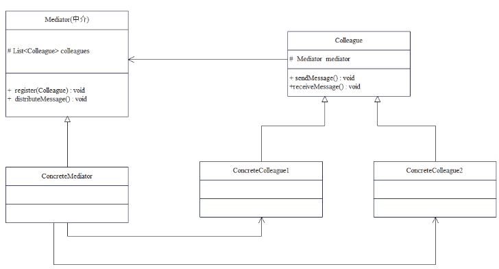
---

**3. 简单 Java 示例：聊天室**

所有用户 User 不直接互相发消息，而是通过 ChatRoom（中介者）。

```java
// 抽象中介者
interface ChatMediator {
    void sendMessage(String message, UserColleague sender);
    void addUser(UserColleague user);
}

// 具体中介者
class ChatRoom implements ChatMediator {
    private List<UserColleague> users = new ArrayList<>();

    @Override
    public void addUser(UserColleague user) {
        users.add(user);
    }

    @Override
    public void sendMessage(String message, UserColleague sender) {
        for (UserColleague user : users) {
            if (user != sender) {
                user.receive(message, sender);
            }
        }
    }
}

// 抽象同事
abstract class UserColleague {
    protected ChatMediator mediator;
    protected String name;

    public UserColleague(ChatMediator mediator, String name) {
        this.mediator = mediator;
        this.name = name;
    }

    public abstract void send(String message);
    public abstract void receive(String message, UserColleague sender);
}

// 具体同事：普通用户
class CommonUser extends UserColleague {
    public CommonUser(ChatMediator mediator, String name) {
        super(mediator, name);
    }

    @Override
    public void send(String message) {
        System.out.println(name + " 发送: " + message);
        mediator.sendMessage(message, this);
    }

    @Override
    public void receive(String message, UserColleague sender) {
        System.out.println(name + " 收到来自 " + sender.name + " 的消息: " + message);
    }
}

// 客户端
public class Client {
    public static void main(String[] args) {
        ChatMediator mediator = new ChatRoom();

        UserColleague alice = new CommonUser(mediator, "Alice");
        UserColleague bob   = new CommonUser(mediator, "Bob");
        UserColleague tom   = new CommonUser(mediator, "Tom");

        mediator.addUser(alice);
        mediator.addUser(bob);
        mediator.addUser(tom);

        alice.send("大家好！");
        bob.send("你好 Alice！");
    }
}
```

**要点：**

- `CommonUser` 不直接持有其它 User 的引用，只持有 `ChatMediator`。
- 发送消息时：`alice.send(...) → mediator.sendMessage(...) → 其它用户.receive(...)`。
- 任何“转发逻辑”（比如只发给某些人、屏蔽某些人）都集中在 `ChatRoom` 里。

---

**4. 类图（文字版）**

```text
              +--------------------------+
              |      ChatMediator       | <<interface>>
              +--------------------------+
              | + sendMessage(msg,sender)|
              | + addUser(user)         |
              +--------------------------+
                         ^
                         |
             +--------------------------+
             |        ChatRoom          | <<ConcreteMediator>>
             +--------------------------+
             | - users: List<UserColleague> |
             +--------------------------+
             | + sendMessage(...)       |
             | + addUser(...)           |
             +--------------------------+


          +-----------------------------+
          |       UserColleague         | <<abstract Colleague>>
          +-----------------------------+
          | - mediator: ChatMediator    |
          | - name: String              |
          +-----------------------------+
          | + send(msg)                 |
          | + receive(msg, sender)      |
          +-----------------------------+
                      ^
                      |
            +-------------------------+
            |       CommonUser        | <<ConcreteColleague>>
            +-------------------------+
            | + send(msg)            |
            | + receive(msg,sender)  |
            +-------------------------+


            +-------------------------+
            |         Client          |
            +-------------------------+
            | + main(args)           |
            +-------------------------+
                       |
                       | creates / wires
                       v
         ChatRoom + several UserColleague
```

---

**5. 什么时候用 Mediator？**

- GUI 中多个控件之间有复杂联动：按钮、输入框、列表等；
- 多个模块之间通信非常混乱（网状引用），希望有一个“调度中心”；
- 聊天室、聊天室服务器、控制塔、调度器等场景。

可以记一句：

> 各个同事不要互相打电话，  
> 大家只联系“中介者”，  
> 由中介者负责“转接”和“协调”。

# XVI Memento

**Memento Pattern（备忘录模式）**

**一句话：**  
在不破坏对象封装的前提下，把对象在某个时刻的内部状态保存起来，需要时可以**恢复到以前的状态**（类似“撤销 / 回退”功能）。

---

**1. 解决什么问题**

常见需求：

- 文本编辑器要支持“撤销/恢复”；
- 游戏要支持“存档 / 读档”；
- 表单填写到一半想“恢复到上一次保存”。

如果直接把对象的所有字段暴露出来保存，会破坏封装。  
备忘录模式的做法是：

> 由对象自己把当前状态打包成一个“备忘录（Memento）”，  
> 外部只保存/传递这个备忘录，**不知道里面有什么**；  
> 以后再把备忘录交回去，让对象自己恢复状态。

---

**2. 角色**

- **Originator（发起人）**
  - 有内部状态；
  - 能创建一个包含自己当前状态的 Memento；
  - 也能用一个 Memento 把自己恢复到之前状态。
- **Memento（备忘录）**
  - 存储 Originator 的内部状态；
  - 对外通常是“只读”或完全透明，防止其他对象直接修改里面的内容。
- **Caretaker（管理者）**
  - 负责保存、管理多个 Memento（比如一个栈/列表），实现多次撤销/恢复；
  - 不关心 Memento 里面的具体状态。

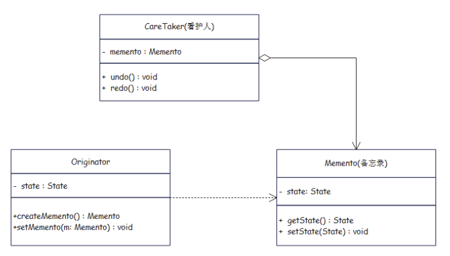
---

**3. 简单 Java 示例：文档编辑撤销**

```java
// 发起人：文档
class Document {
    private String content;

    public void setContent(String content) {
        this.content = content;
        System.out.println("当前内容: " + this.content);
    }

    public String getContent() {
        return content;
    }

    // 创建备忘录
    public Memento createMemento() {
        return new Memento(this.content);
    }

    // 从备忘录恢复
    public void restore(Memento memento) {
        this.content = memento.getContent();
        System.out.println("恢复内容: " + this.content);
    }
}

// 备忘录：内部只存状态
class Memento {
    private final String content;

    public Memento(String content) {
        this.content = content;
    }

    // 通常只允许 Originator 使用
    public String getContent() {
        return content;
    }
}

// 管理者：管理多个备忘录
class Caretaker {
    private List<Memento> history = new ArrayList<>();

    public void addMemento(Memento memento) {
        history.add(memento);
    }

    public Memento getMemento(int index) {
        return history.get(index);
    }
}

// 客户端
public class Client {
    public static void main(String[] args) {
        Document doc = new Document();
        Caretaker caretaker = new Caretaker();

        doc.setContent("版本1");
        caretaker.addMemento(doc.createMemento());

        doc.setContent("版本2");
        caretaker.addMemento(doc.createMemento());

        doc.setContent("版本3"); // 未保存

        // 撤销到版本1
        doc.restore(caretaker.getMemento(0));
    }
}
```

执行过程：

1. `setContent("版本1")` → 保存一个备忘录 M1。
2. `setContent("版本2")` → 保存一个备忘录 M2。
3. `setContent("版本3")` → 当前内容变为版本3，但没保存。
4. `restore(M1)` → 文档恢复到“版本1”。

**关键点：**

- `Document` 自己知道如何从备忘录恢复；
- `Caretaker` 只管“存”和“取”，不知道备忘录里面有什么；
- 封装性得到保护。

---

**4. 使用场景**

- 需要“撤销 / 重做”的地方（编辑器、绘图工具、IDE）。
- 需要“快照 / 存档”的地方（游戏、工作流引擎）。
- 希望在不暴露对象内部实现的前提下，保存和恢复其状态。

**一句总结：**

> Memento = 对象内部状态的“快照”，  
> Originator 会把自己的状态保存成快照，也能从快照恢复，  
> Caretaker 负责管理这些快照，从而实现撤销 / 回退。

# XVII Iterator

**Iterator Pattern（迭代器模式）**

**一句话：**  
在**不暴露集合内部表示**（数组、链表、树等）的前提下，提供一种统一的方式顺序访问集合中的元素。

可以把它理解为：  
> 把“遍历逻辑”从集合类中抽出来，专门放到“迭代器对象”里。

---

**1. 解决什么问题**

没有迭代器时，你必须知道集合的内部结构：

```java
// 数组
for (int i = 0; i < array.length; i++) { ... }

// 链表
for (Node n = head; n != null; n = n.next) { ... }
```

- 不同集合写法不统一；
- 客户端代码直接依赖集合的内部结构；
- 集合内部一旦改结构（比如从数组改成链表），外部遍历代码全部要改。

迭代器模式：

- 集合只需要提供一个 `iterator()` 方法；
- 客户端**通过迭代器接口**访问元素，不关心内部到底是数组还是链表。

---

**2. 核心角色**

- **Iterator（迭代器接口）**
  - 定义遍历的方法，如 `hasNext()`、`next()`。
- **ConcreteIterator（具体迭代器）**
  - 持有对集合的引用，记录当前遍历位置，实现具体遍历逻辑。
- **Aggregate / Collection（聚合接口）**
  - 声明 `iterator()` 或 `createIterator()` 方法。
- **ConcreteAggregate（具体聚合类）**
  - 实现集合存储和 `iterator()`，返回一个具体迭代器。

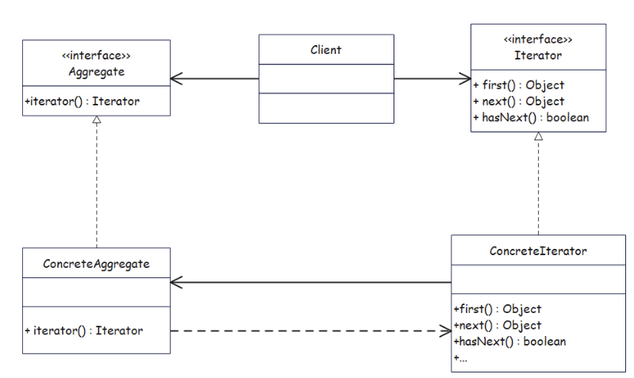
---

**3. 简单 Java 示例（去掉 Java 标准库，自己实现一遍）**

```java
// 迭代器接口
interface MyIterator {
    boolean hasNext();
    String next();
}

// 聚合接口
interface MyCollection {
    MyIterator iterator();
}

// 具体聚合：字符串数组
class NameCollection implements MyCollection {
    private String[] names;

    public NameCollection(String[] names) {
        this.names = names;
    }

    @Override
    public MyIterator iterator() {
        return new NameIterator();
    }

    // 具体迭代器作为内部类
    private class NameIterator implements MyIterator {
        private int index = 0;

        @Override
        public boolean hasNext() {
            return index < names.length;
        }

        @Override
        public String next() {
            return names[index++];
        }
    }
}

// 客户端
public class Client {
    public static void main(String[] args) {
        String[] data = { "Alice", "Bob", "Tom" };
        MyCollection collection = new NameCollection(data);
        MyIterator it = collection.iterator();

        while (it.hasNext()) {
            System.out.println(it.next());
        }
    }
}
```

**要点：**

- 客户端只依赖 `MyIterator` 和 `MyCollection` 接口；
- 不需要知道 `NameCollection` 里面是数组、链表还是别的结构；
- 将来如果 `NameCollection` 改成 `ArrayList`、`LinkedList`，只要迭代器实现保持不变，外部遍历代码可以不动。

---

**4. 和 Java 标准库的关系**

Java 自带的：

- `java.util.Iterator<E>`：有 `boolean hasNext()`、`E next()`、`void remove()`；
- `Iterable<T>` 接口：定义 `Iterator<T> iterator()` 方法；
- 所有集合类（List、Set、Map 的 keySet 等）都实现了 `Iterable`。

当你写：

```java
for (String s : list) { ... }
```

编译器会自动使用迭代器模式，相当于：

```java
Iterator<String> it = list.iterator();
while (it.hasNext()) {
    String s = it.next();
    ...
}
```

---

**一、整理后的代码**

```java
import java.util.ArrayList;
import java.util.Iterator;
import java.util.List;

// 行车记录仪，保存最近 10 条视频记录
public class NewDrivingRecorder implements Iterable<String> {

    private int index = -1;              // 当前写入位置
    private String[] records = new String[10]; // 循环数组，长度 10

    // 追加一条新记录（覆盖最旧的）
    public void append(String record) {
        if (index == 9) {
            index = 0;       // 到尾了就从头开始循环
        } else {
            index++;
        }
        records[index] = record;
    }

    @Override
    public Iterator<String> iterator() {
        return new Itr();
    }

    // 内部迭代器类：从“最新一条”开始，最多遍历 10 条
    private class Itr implements Iterator<String> {
        int cursor = index;   // 当前读取位置，初始化为最新记录的位置
        int loopCount = 0;    // 已经返回了多少条记录

        @Override
        public boolean hasNext() {
            return loopCount < 10; // 最多返回 10 条
        }

        @Override
        public String next() {
            int i = cursor;   // 先记下当前下标

            // 为下一次遍历移动游标：向前一格，环形回绕
            if (cursor == 0) {
                cursor = 9;
            } else {
                cursor--;
            }

            loopCount++;
            return records[i]; // 返回当前下标对应的记录
        }
    }
}
```

```java
public class Client {
    public static void main(String[] args) {
        NewDrivingRecorder dr = new NewDrivingRecorder();

        // 连续写入 12 条记录，数组长度只有 10，会覆盖最早的 2 条
        for (int i = 0; i < 12; i++) {
            dr.append("视频_" + i);
        }

        List<String> uStorage = new ArrayList<>();
        Iterator<String> it = dr.iterator();

        // 从“最新”开始向前遍历最近 10 条记录
        while (it.hasNext()) {
            String video = it.next();
            System.out.println(video);

            // 挑出我们关心的录像作为“事故证据”
            if ("视频_10".equals(video) || "视频_8".equals(video)) {
                uStorage.add(video);
            }
        }

        System.out.println("事故证据 " + uStorage);
    }
}
```

---

**二、代码解释**

1. **NewDrivingRecorder：行车记录仪（聚合类，Iterable）**

   - 字段：
     - `int index = -1;`  
       当前写入的位置下标。初始为 -1，第一次 `append` 时会变为 0。
     - `String[] records = new String[10];`  
       固定长为 10 的数组，表示“只保留最近 10 条视频”。

   - `append(String record)`：
     - 逻辑：**循环覆盖**。
       - 如果当前 `index == 9`（数组最后一格），下一条记录写回 `0` 号位置；
       - 否则 `index++` 写到下一格。
     - 写入：`records[index] = record;`  
       这样超过 10 条时，会覆盖最旧的记录，符合行车记录仪“只保留最近一段”的特性。

   - `iterator()`：
     - 返回一个新的内部迭代器 `new Itr()`；
     - 因为类实现了 `Iterable<String>`，所以可以在外部用 `for-each` 或手动使用 `Iterator<String>` 来遍历。

2. **内部类 Itr：具体迭代器，实现 `Iterator<String>`**

   - 字段：
     - `int cursor = index;`  
       当前读取指针，初始化为最新写入的位置，也就是**最新的视频**。
     - `int loopCount = 0;`  
       已经返回了多少条记录，用来限制最多只遍历 10 条。

   - `hasNext()`：
     - 条件：`loopCount < 10`  
       因为数组只有 10 个位置，最多返回 10 次。
     - 这相当于说：“迭代器还没把 10 个槽位都看一遍吗？”

   - `next()`：
     - 先保存当前 `cursor` 为 `i`；
     - 然后移动游标（为下一次迭代做准备）：
       - 如果当前是 0，则下一个位置回绕到 9（环形）；  
       - 否则 `cursor--`，向前移动一格。
     - `loopCount++` 表示已经返回了一条；
     - 返回 `records[i]`：即调用 `next()` 时当前位置的视频记录。

   - 遍历顺序：
     - 从“最新一条”开始；
     - 每次向前一个位置，环形回绕，一共遍历 10 次 → 最近 10 段视频，从新到旧。

3. **Client：使用示例**

   - 写入 12 条记录：

     ```java
     for (int i = 0; i < 12; i++) {
         dr.append("视频_" + i);
     }
     ```

     - 数组长度是 10，所以最终保留下来的实际上是 `视频_2` 到 `视频_11` 这 10 条（前 2 条被覆盖）。

   - 获取迭代器并遍历：

     ```java
     Iterator<String> it = dr.iterator();
     while (it.hasNext()) {
         String video = it.next();
         System.out.println(video);
         ...
     }
     ```

     - 从最新的视频（`视频_11`）开始，打印最近 10 条；
     - 在遍历过程中，如果遇到 `"视频_10"` 或 `"视频_8"`，就加入 `uStorage` 作为“事故证据”。

   - 最后打印：

     ```java
     System.out.println("事故证据 " + uStorage);
     ```

---

**三、类图（文本 UML）**

```text
               +------------------------------+
               |        Iterable<T>           |  (来自 java.lang)
               +------------------------------+
               | + iterator(): Iterator<T>    |
               +------------------------------+
                          ^
                          |
               +------------------------------+
               |     NewDrivingRecorder       |
               +------------------------------+
               | - index: int                 |
               | - records: String[]          |
               +------------------------------+
               | + append(record:String):void |
               | + iterator():Iterator<String>|
               +------------------------------+
                          |
                          | creates
                          v
               +------------------------------+
               |   Itr (inner class)          |
               |   implements Iterator<String>|
               +------------------------------+
               | - cursor: int                |
               | - loopCount: int             |
               +------------------------------+
               | + hasNext(): boolean         |
               | + next(): String             |
               +------------------------------+
                          |
                          | uses
                          v
                       records[]


               +------------------------------+
               |           Client             |
               +------------------------------+
               | + main(args:String[]):void   |
               +------------------------------+
                          |
                          | uses
                          v
                 NewDrivingRecorder, Iterator<String>,
                 List<String> / ArrayList<String>
```

- `NewDrivingRecorder`：**聚合类，Iterable**，里面维护记录数组，提供 `iterator()`。
- `Itr`：**具体迭代器**，实现 `Iterator<String>`，负责“从最新往前遍历 10 条”的逻辑。
- `Client`：使用方，通过 `iterator()` 获取迭代器，遍历并挑选需要的视频。

# XVIII Flyweight

**Flyweight Pattern（享元模式）**

**一句话：**  
当系统中需要创建**大量“长得很像”的小对象**时，把它们的**不变部分（内部状态）共享出来**，只为变化部分（外部状态）单独存储，从而大幅节省内存。

---

**1. 场景直觉**

典型场景：

- 游戏里有几千棵树：种类就几种（样式、纹理一样），只有**位置、大小**不同；
- 文本编辑器里有几万、几十万字符：  
  每个字符对象不需要都保存 `"A"`、`"B"` 这些信息，只需要**共享**字体、字号、样式，单独保存坐标即可。

如果每一个对象都把全部信息都存一份，会非常浪费内存。

享元模式的做法：

> 把对象拆成：  
> - **内部状态（intrinsic state）**：可以共享、不随场景变化的部分 → 由享元对象内部保存。  
> - **外部状态（extrinsic state）**：每个使用场景都不同的部分 → 由调用方在使用时传进来。

同时通过一个 **FlyweightFactory（享元工厂）** 来维护已经创建过的享元对象（缓存 / 池）。

---

**2. 角色**

- **Flyweight（享元接口）**
  - 声明对外提供的操作方法，比如 `draw(x, y)`。
- **ConcreteFlyweight（具体享元）**
  - 内部保存可以共享的状态（intrinsic state）；
  - 方法参数中接收外部状态（extrinsic state）。
- **FlyweightFactory（享元工厂）**
  - 负责创建和管理享元对象；
  - 通过某种 key（如字符、颜色、类型）缓存已创建的享元，重复请求时直接返回已有对象。
- **Client（客户端）**
  - 不直接 `new ConcreteFlyweight`，而是向工厂要；
  - 自己维护外部状态，并在调用享元方法时传进来。

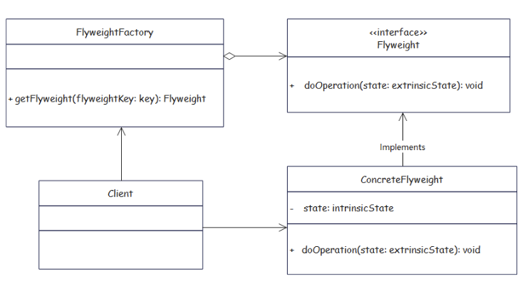
---

**3. 简单 Java 示例：森林里的树**

假设森林里有很多棵树，每棵树的“类型”（种类、纹理、颜色）数量不多，但**位置**非常多样。

```java
// 享元接口
interface Tree {
    void draw(int x, int y); // x,y 是外部状态：树在地图上的位置
}

// 具体享元：树的类型（内部状态可共享）
class TreeType implements Tree {
    private String name;     // 名称：柳树、松树...
    private String texture;  // 纹理
    private String color;    // 颜色

    public TreeType(String name, String texture, String color) {
        this.name = name;
        this.texture = texture;
        this.color = color;
    }

    @Override
    public void draw(int x, int y) {
        System.out.println("在 (" + x + "," + y + ") 画一棵 " + color + " 的 " + name);
    }
}

// 享元工厂：缓存 TreeType
class TreeFactory {
    private static Map<String, TreeType> pool = new HashMap<>();

    public static TreeType getTreeType(String name, String texture, String color) {
        String key = name + "_" + texture + "_" + color;
        TreeType type = pool.get(key);
        if (type == null) {
            type = new TreeType(name, texture, color);
            pool.put(key, type);
        }
        return type;
    }
}

// 客户端：森林
class Forest {
    private static class TreeInfo {
        int x, y;
        TreeType type;
        TreeInfo(int x, int y, TreeType type) {
            this.x = x;
            this.y = y;
            this.type = type;
        }
    }

    private List<TreeInfo> trees = new ArrayList<>();

    public void plantTree(int x, int y, String name, String texture, String color) {
        TreeType type = TreeFactory.getTreeType(name, texture, color);
        trees.add(new TreeInfo(x, y, type));
    }

    public void draw() {
        for (TreeInfo t : trees) {
            t.type.draw(t.x, t.y);
        }
    }
}

// 测试
public class Client {
    public static void main(String[] args) {
        Forest forest = new Forest();

        // 虽然调用多次，但同一类型的 TreeType 只会创建一次
        forest.plantTree(10, 20, "柳树", "纹理A", "绿色");
        forest.plantTree(30, 40, "柳树", "纹理A", "绿色");
        forest.plantTree(50, 60, "松树", "纹理B", "深绿");
        forest.plantTree(70, 80, "柳树", "纹理A", "绿色");

        forest.draw();
    }
}
```

关键点：

- `TreeType` 的 `name/texture/color` 是**内部状态**，被多棵树共享；
- 每棵树的 `(x, y)` 是**外部状态**，由 `TreeInfo` 单独保存；
- 工厂 `TreeFactory` 使用 `Map` 做缓存：同一组合只会创建一个 `TreeType` 实例。

在大量树的情况下，内存从“每棵树一个 `TreeType`”变成“每种树一个 `TreeType`”。

---

**4. 什么时候考虑 Flyweight**

- 系统中要创建非常多的对象（成千上万），导致内存压力大；
- 这些对象的大部分状态是**相同的、可以抽取成共享部分**；
- 对象状态可以清晰地拆分为：
  - 内部状态（可共享、不变）；
  - 外部状态（不共享、变化多）。

典型应用：

- 字符/字体渲染（文本编辑器中的文字对象）；
- 地图/游戏中的大量相同元素（树、石头、子弹等）；
- 数据库连接池中的连接对象内部复用（更复杂场景）。

---

**一句总结：**

> Flyweight = “共享小对象的内部状态 + 把变化的外部状态拿到外面”，  
> 用工厂管理这些共享对象，就可以在海量对象场景下节省大量内存。

---
# Six Principles of Software Design


## 1. SRP —— Single Responsibility Principle（单一职责原则）

**核心一句话**  
一个类 / 模块**只应该有一个引起它变化的原因**，也就是只负责一类职责。

**怎么做**

- 避免“上帝类”：一个类同时负责 UI、数据访问、业务逻辑、日志……  
- 职责划分按“业务功能”，不是按技术层：  
  - “用户管理”“日志”“验证”“发送邮件”最好是不同类。  
- 一旦发现这个类修改频率非常高，且修改原因各不相同，说明职责太多，应该拆。

**简单例子**

反例：

```java
class UserManager {
    void register(User u) { /* 校验 + 写数据库 + 发欢迎邮件 */ }
}
```

改成：

```java
class UserService {
    void register(User u) { /* 校验 + 调用 repo + 调用 emailService */ }
}

class UserRepository { void save(User u) { ... } }

class EmailService { void sendWelcomeMail(User u) { ... } }
```

**联系**

- 职责单一后，每个类更容易遵守 OCP（只围绕一类变化扩展）。
- SRP 做好了，测试、维护成本大幅降低。

---

## 2. OCP —— Open-Closed Principle（开闭原则）

**核心一句话**  
**对扩展开放，对修改关闭**：要增加新功能时，尽量通过**新增类 / 新实现**，而不是去改一堆旧代码。

**怎么做**

- 用接口 / 抽象类描述稳定的行为，用实现类承载变化。  
- 典型手段：**多态 + 继承 + 组合 + 策略模式**。  
- 新增需求 = 新的实现类，而不是在旧类里疯狂加 if / switch。

**简单例子**

反例：每加一种支付方式就改一次 if。

```java
class PayService {
    void pay(String type) {
        if ("ALIPAY".equals(type)) { ... }
        else if ("WECHAT".equals(type)) { ... }
        else if ("BANK".equals(type)) { ... }
    }
}
```

OCP 写法：

```java
interface Payment {
    void pay();
}

class Alipay implements Payment { ... }
class Wechat implements Payment { ... }

class PayService {
    private Payment payment;
    public PayService(Payment payment) { this.payment = payment; }
    void pay() { payment.pay(); }
}
```

**联系**

- OCP 强调“增加新功能尽量是 add，而不是 modify”；  
- 想做到这一点，通常会配合 DIP（面向抽象编程）。

---

## 3. LSP —— Liskov Substitution Principle（里氏替换原则）

**核心一句话**  
**子类必须能替换父类**使用，而不会破坏程序的正确性。  
也就是：用父类的地方，换成任何一个子类都应该“没毛病”。

**怎么做**

- 子类不能随意“改掉”父类的行为契约：  
  - 不能把输入限制变得更严格（前置条件更强）；  
  - 不能把输出保证变弱（后置条件变少）。  
- 不要为了复用代码而乱继承——如果行为不兼容，就考虑**组合**而不是继承。

**经典反例：Square vs Rectangle**

```java
class Rectangle {
    void setWidth(int w) { ... }
    void setHeight(int h) { ... }
}

class Square extends Rectangle {
    @Override
    void setWidth(int w) { super.setWidth(w); super.setHeight(w); }
    @Override
    void setHeight(int h) { super.setWidth(h); super.setHeight(h); }
}
```

使用方：

```java
Rectangle r = new Rectangle();
r.setWidth(2);
r.setHeight(3);
assert r.getArea() == 6;
```

如果 `Rectangle r = new Square();`，就完全违背了使用方的预期 → 违反 LSP。

**联系**

- LSP 是在提醒你：**继承不只是复用代码，更是复用“行为约定”**。  
- 如果不满足 LSP，OCP 也会变得危险（你新增的子类会“破坏多态”）。

---

## 4. ISP —— Interface Segregation Principle（接口隔离原则）

**核心一句话**  
客户端**不应该被迫依赖它不需要的方法**；接口要“**小而专一**”，而不是“一口气全家桶”。

**怎么做**

- 把大而全的接口拆成多个细颗粒度的小接口，每个接口只为一类角色服务。  
- 调用方只依赖自己真正需要的那一个 / 那几个接口。

**简单例子**

反例：胖接口。

```java
interface Printer {
    void print();
    void scan();
    void fax();
}
```

很多设备只会“打印”，却被迫实现 `scan`、`fax`（空实现或者抛异常），很尴尬。

ISP 写法：

```java
interface Printable { void print(); }
interface Scannable { void scan(); }
interface Faxable { void fax(); }

class SimplePrinter implements Printable { ... }
class MultiFunctionPrinter implements Printable, Scannable, Faxable { ... }
```

**联系**

- ISP 是“SRP 在接口层面的体现”：接口也要职责单一。  
- 细颗粒度接口更配合 DIP：上层模块依赖的抽象会更精准。

---

## 5. DIP —— Dependency Inversion Principle（依赖倒置原则）

**核心一句话**  
高层模块**不应该依赖低层模块**，二者都应该依赖抽象；抽象不依赖细节，细节要依赖抽象。

**通俗版**  

> 业务层只依赖**接口 / 抽象类**，  
> 具体实现（比如 MySQL、MongoDB）是可以替换的细节。

**怎么做**

- 定义好抽象接口（例如 `Repository`、`PaymentGateway`）。  
- 高层模块依赖这些接口，而不是具体的 `MysqlRepository` 等。  
- 通过**依赖注入（DI）**把具体实现传进来（构造注入、setter、Spring 的 `@Autowired` 等）。

**简单例子**

反例：

```java
class UserService {
    private MysqlUserRepository repo = new MysqlUserRepository();
}
```

改成：

```java
interface UserRepository { ... }

class MysqlUserRepository implements UserRepository { ... }
class MongoUserRepository implements UserRepository { ... }

class UserService {
    private UserRepository repo;
    public UserService(UserRepository repo) { this.repo = repo; }
}
```

切数据库只要传不同实现，不用改 `UserService` 代码。

**联系**

- DIP + OCP：  
  - 对扩展开放：新增实现类；  
  - 对修改关闭：高层模块不用改。  
- 也是 IoC / DI 容器（如 Spring）的底层思想。

---

## 6. LoD —— Law of Demeter（迪米特法则 / 最少知道原则）

**核心一句话**  
一个对象应该 **只和“直接的朋友”说话**，不要和“朋友的朋友”直接交互。  
——“只和你前台窗口说话，不要自己跑进后台机房。”

**谁是“直接朋友”？**

在一个方法里，以下这些对象是“直接朋友”，可以调用它们的方法：

- 当前对象 `this`
- 当前对象的成员变量
- 方法参数
- 方法内部新建的局部对象
- （少量）全局单例 / 注入对象

而下面这种“火车式”链式访问就是在跟“陌生人”说话：

```java
order.getCustomer().getAddress().getCity().getName();
```

调用方知道 Order 内部到底有多少层结构，耦合过高。

**怎么改**

- 在“更合适的类”中封装行为，让调用方只调用**一层方法**：

```java
class Customer {
    private Address address;
    public String getCityName() {
        return address.getCity().getName();
    }
}

class Order {
    private Customer customer;
    public String getCustomerCityName() {
        return customer.getCityName();
    }
}

// 使用方：
String cityName = order.getCustomerCityName();
```

- 每个类只对“自己的那一层”负责，知道谁该干什么，不去越界操作别人内部。

**好处**

- 降低耦合：内层结构变动只影响少数类。  
- 提升可维护性：调用处不关心对象内部是怎么嵌套的。  
- 经常配合 SRP 一起出现：职责清晰、依赖少。

---

## 复习小口诀

你可以用下面这几句来记 6 个原则的核心：

- **SRP**：一类一职责，**一个变化原因**。  
- **OCP**：加功能多“加类”，少“改类”。  
- **LSP**：子类能替父类用，**行为不能变味**。  
- **ISP**：接口要小而专，“**只给我需要的**”。  
- **DIP**：高层依赖抽象，细节依赖抽象，**不要依赖具体实现**。  
- **LoD**：只和直接朋友聊，**别写 getA().getB().getC()**。
